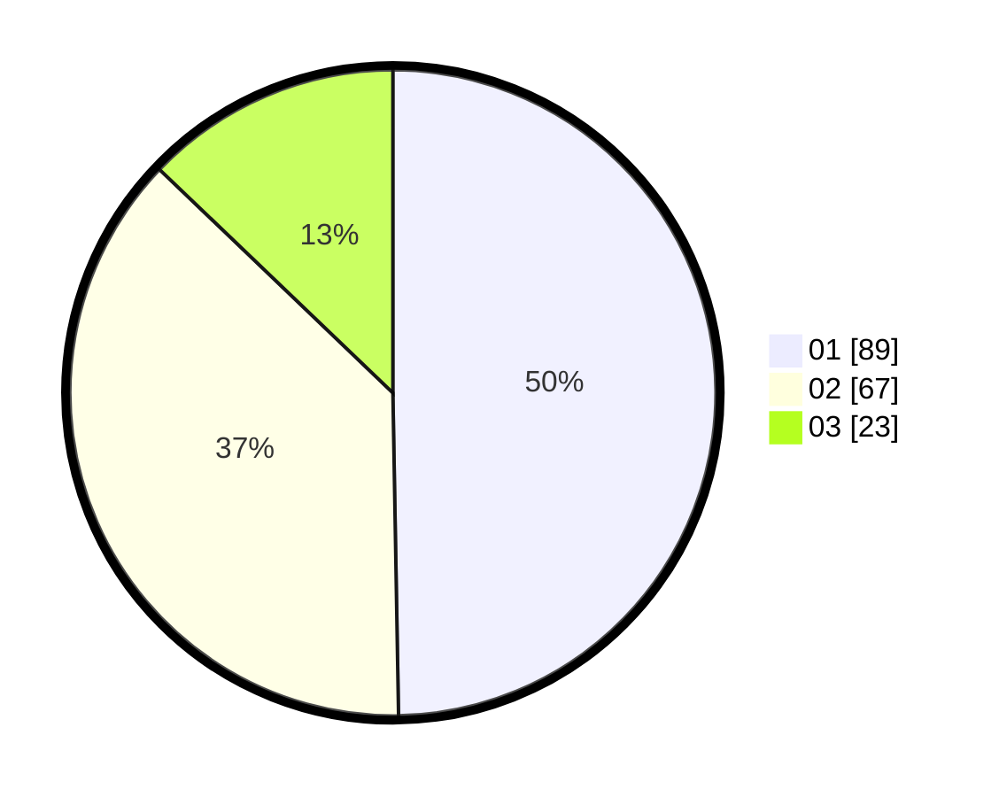

# Hasil

Hasil perolehan suara paslon dapat dilihat pada file paslon-01.txt, paslon-02.txt, dan paslon-03.txt.

Jika tidak ada, artinya data tersebut belum ada pada SIREKAP.

## Perolehan Suara

 * Paslon 01: **89**.
 * Paslon 02: **67**.
 * Paslon 03: **23**.

## Foto C Plano

https://sirekap-obj-formc.kpu.go.id/63ec/pemilu/ppwp/31/71/02/10/03/3171021003063-20240214-155752--c268ad45-2620-4dd5-84c5-dcb9a4fc71f6.jpg

https://sirekap-obj-formc.kpu.go.id/63ec/pemilu/ppwp/31/71/02/10/03/3171021003063-20240214-155400--101cddab-b43e-460b-a034-7037d29ae2a9.jpg

https://sirekap-obj-formc.kpu.go.id/63ec/pemilu/ppwp/31/71/02/10/03/3171021003063-20240214-162217--3f312cc5-da05-4e7e-a485-d30b3d6d90bc.jpg

## DATA PEMILIH TETAP

Jumlah pemilih dalam DPT: **247**.
 * L: **120**.
 * P: **127**.

## DATA PENGGUNA HAK PILIH

Jumlah pengguna hak pilih dalam DPT: **177**.
 * L: **84**.
 * P: **93**.

Jumlah pengguna hak pilih dalam DPTb: **0**.
 * L: **0**.
 * P: **0**.

Jumlah pengguna hak pilih dalam DPK: **2**.
 * L: **1**.
 * P: **1**.

Jumlah pengguna hak pilih: **179**.
 * L: **85**.
 * P: **94**.

## JUMLAH SUARA SAH DAN TIDAK SAH

JUMLAH SELURUH SUARA SAH: **179**.

JUMLAH SUARA TIDAK SAH: **0**.

JUMLAH SELURUH SUARA SAH DAN SUARA TIDAK SAH: **179**.
