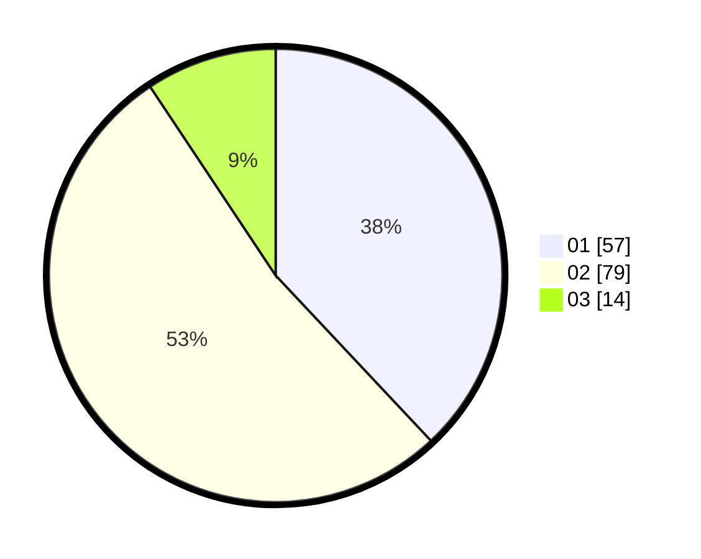

# Hasil

Hasil perolehan suara paslon dapat dilihat pada file paslon-01.txt, paslon-02.txt, dan paslon-03.txt.

Jika tidak ada, artinya data tersebut belum ada pada SIREKAP.

## Perolehan Suara

 * Paslon 01: **57**.
 * Paslon 02: **79**.
 * Paslon 03: **14**.

## Foto C Plano

https://sirekap-obj-formc.kpu.go.id/5da9/pemilu/ppwp/31/71/02/10/03/3171021003065-20240216-212349--582e47ef-9b12-4117-8297-e4e0cc51e11c.jpg

https://sirekap-obj-formc.kpu.go.id/5da9/pemilu/ppwp/31/71/02/10/03/3171021003065-20240216-222016--13e16b80-023f-4d79-beaf-cd3f60a6383d.jpg

https://sirekap-obj-formc.kpu.go.id/5da9/pemilu/ppwp/31/71/02/10/03/3171021003065-20240216-215209--03f67009-1cde-4886-8ea3-1dfcb485639e.jpg

## DATA PEMILIH TETAP

Jumlah pemilih dalam DPT: **228**.
 * L: **119**.
 * P: **109**.

## DATA PENGGUNA HAK PILIH

Jumlah pengguna hak pilih dalam DPT: **154**.
 * L: **76**.
 * P: **78**.

Jumlah pengguna hak pilih dalam DPTb: **4**.
 * L: **1**.
 * P: **3**.

Jumlah pengguna hak pilih dalam DPK: **4**.
 * L: **2**.
 * P: **2**.

Jumlah pengguna hak pilih: **154**.
 * L: **76**.
 * P: **78**.

## JUMLAH SUARA SAH DAN TIDAK SAH

JUMLAH SELURUH SUARA SAH: **150**.

JUMLAH SUARA TIDAK SAH: **4**.

JUMLAH SELURUH SUARA SAH DAN SUARA TIDAK SAH: **154**.
