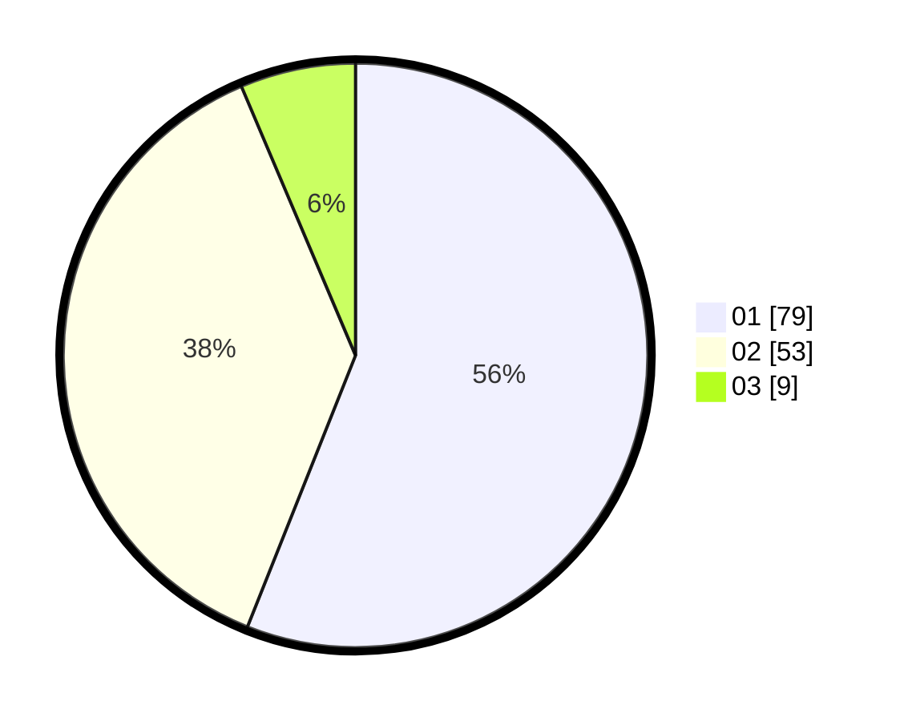

# Hasil

Hasil perolehan suara paslon dapat dilihat pada file paslon-01.txt, paslon-02.txt, dan paslon-03.txt.

Jika tidak ada, artinya data tersebut belum ada pada SIREKAP.

## Perolehan Suara

 * Paslon 01: **79**.
 * Paslon 02: **53**.
 * Paslon 03: **9**.

## Foto C Plano

https://sirekap-obj-formc.kpu.go.id/e672/pemilu/ppwp/31/71/02/10/03/3171021003066-20240218-010930--c28dbb7b-7944-4e80-8eed-a6655d90d9cb.jpg

https://sirekap-obj-formc.kpu.go.id/e672/pemilu/ppwp/31/71/02/10/03/3171021003066-20240218-012306--36b7bc9b-784e-4b6e-860f-43cebc57dbe0.jpg

https://sirekap-obj-formc.kpu.go.id/e672/pemilu/ppwp/31/71/02/10/03/3171021003066-20240218-010943--0c28bbb5-0280-4449-b84a-f183f0414921.jpg

## DATA PEMILIH TETAP

Jumlah pemilih dalam DPT: **218**.
 * L: **106**.
 * P: **112**.

## DATA PENGGUNA HAK PILIH

Jumlah pengguna hak pilih dalam DPT: **140**.
 * L: **63**.
 * P: **77**.

Jumlah pengguna hak pilih dalam DPTb: **0**.
 * L: **0**.
 * P: **0**.

Jumlah pengguna hak pilih dalam DPK: **1**.
 * L: **1**.
 * P: **0**.

Jumlah pengguna hak pilih: **141**.
 * L: **64**.
 * P: **77**.

## JUMLAH SUARA SAH DAN TIDAK SAH

JUMLAH SELURUH SUARA SAH: **141**.

JUMLAH SUARA TIDAK SAH: **2**.

JUMLAH SELURUH SUARA SAH DAN SUARA TIDAK SAH: **143**.
