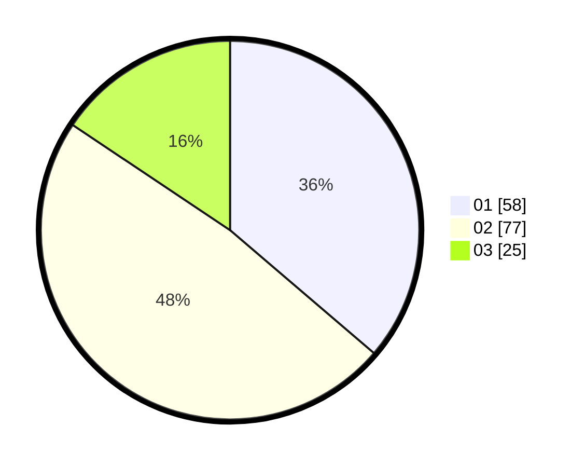

# Hasil

Hasil perolehan suara paslon dapat dilihat pada file paslon-01.txt, paslon-02.txt, dan paslon-03.txt.

Jika tidak ada, artinya data tersebut belum ada pada SIREKAP.

## Perolehan Suara

 * Paslon 01: **58**.
 * Paslon 02: **77**.
 * Paslon 03: **25**.

## Foto C Plano

https://sirekap-obj-formc.kpu.go.id/312c/pemilu/ppwp/31/71/02/10/03/3171021003068-20240218-201523--e130da8b-a195-4147-8b61-829c744affdd.jpg

https://sirekap-obj-formc.kpu.go.id/312c/pemilu/ppwp/31/71/02/10/03/3171021003068-20240218-203523--dc5d0923-13bb-4c20-b9ed-0ae5e25431a2.jpg

https://sirekap-obj-formc.kpu.go.id/312c/pemilu/ppwp/31/71/02/10/03/3171021003068-20240218-202458--dedcc76d-337a-4ac8-9b23-4b162ca1294f.jpg

## DATA PEMILIH TETAP

Jumlah pemilih dalam DPT: **242**.
 * L: **115**.
 * P: **127**.

## DATA PENGGUNA HAK PILIH

Jumlah pengguna hak pilih dalam DPT: **161**.
 * L: **75**.
 * P: **86**.

Jumlah pengguna hak pilih dalam DPTb: **0**.
 * L: **0**.
 * P: **0**.

Jumlah pengguna hak pilih dalam DPK: **1**.
 * L: **1**.
 * P: **0**.

Jumlah pengguna hak pilih: **162**.
 * L: **76**.
 * P: **86**.

## JUMLAH SUARA SAH DAN TIDAK SAH

JUMLAH SELURUH SUARA SAH: **160**.

JUMLAH SUARA TIDAK SAH: **2**.

JUMLAH SELURUH SUARA SAH DAN SUARA TIDAK SAH: **162**.
