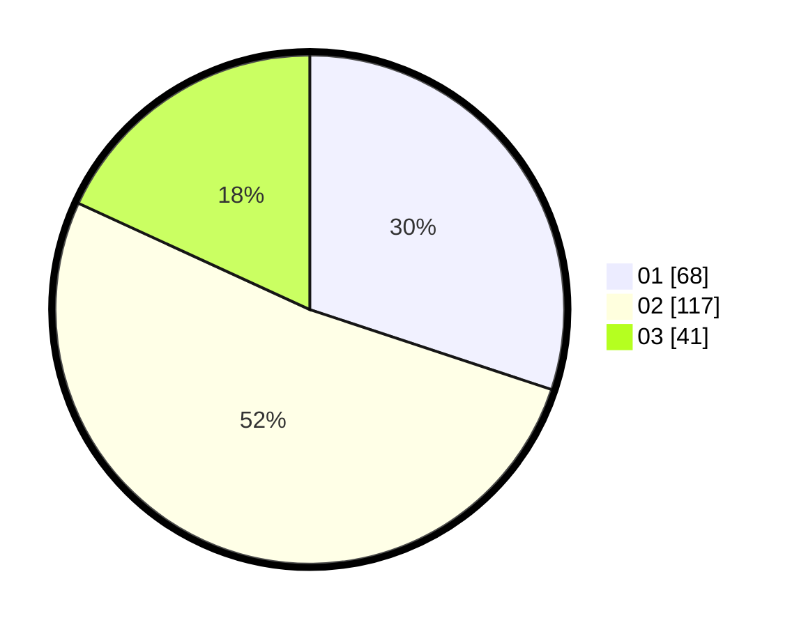

# Hasil

Hasil perolehan suara paslon dapat dilihat pada file paslon-01.txt, paslon-02.txt, dan paslon-03.txt.

Jika tidak ada, artinya data tersebut belum ada pada SIREKAP.

## Perolehan Suara

 * Paslon 01: **68**.
 * Paslon 02: **117**.
 * Paslon 03: **41**.

## Foto C Plano

https://sirekap-obj-formc.kpu.go.id/b88a/pemilu/ppwp/31/71/02/10/03/3171021003074-20240218-152539--9aa4a33e-e53e-4f37-a024-d181955f04a3.jpg

https://sirekap-obj-formc.kpu.go.id/b88a/pemilu/ppwp/31/71/02/10/03/3171021003074-20240218-195623--7d87f686-6ba2-4a3c-be54-2c7c54474832.jpg

https://sirekap-obj-formc.kpu.go.id/b88a/pemilu/ppwp/31/71/02/10/03/3171021003074-20240218-200959--474330be-71d5-41fe-b5d9-157ede492d3e.jpg

## DATA PEMILIH TETAP

Jumlah pemilih dalam DPT: **287**.
 * L: **152**.
 * P: **135**.

## DATA PENGGUNA HAK PILIH

Jumlah pengguna hak pilih dalam DPT: **227**.
 * L: **118**.
 * P: **109**.

Jumlah pengguna hak pilih dalam DPTb: **0**.
 * L: **0**.
 * P: **0**.

Jumlah pengguna hak pilih dalam DPK: **1**.
 * L: **1**.
 * P: **0**.

Jumlah pengguna hak pilih: **228**.
 * L: **119**.
 * P: **109**.

## JUMLAH SUARA SAH DAN TIDAK SAH

JUMLAH SELURUH SUARA SAH: **226**.

JUMLAH SUARA TIDAK SAH: **2**.

JUMLAH SELURUH SUARA SAH DAN SUARA TIDAK SAH: **228**.
