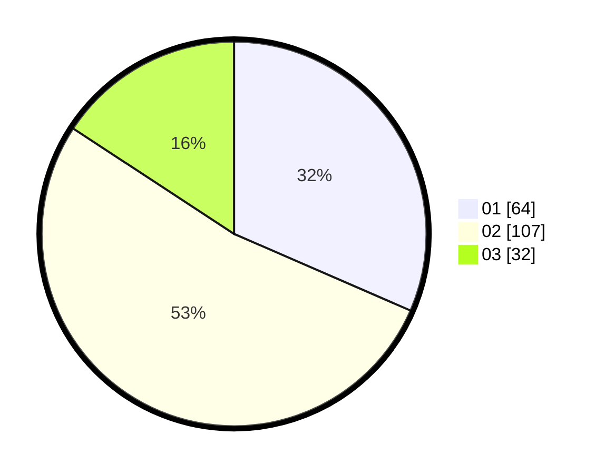

# Hasil

Hasil perolehan suara paslon dapat dilihat pada file paslon-01.txt, paslon-02.txt, dan paslon-03.txt.

Jika tidak ada, artinya data tersebut belum ada pada SIREKAP.

## Perolehan Suara

 * Paslon 01: **64**.
 * Paslon 02: **107**.
 * Paslon 03: **32**.

## Foto C Plano

https://sirekap-obj-formc.kpu.go.id/9459/pemilu/ppwp/31/71/02/10/03/3171021003076-20240215-030036--eebc60d4-1e86-4f62-964c-ff0ed5171f20.jpg

https://sirekap-obj-formc.kpu.go.id/9459/pemilu/ppwp/31/71/02/10/03/3171021003076-20240215-030057--fd491c07-ae1a-4d9a-a049-a82b24003dbb.jpg

https://sirekap-obj-formc.kpu.go.id/9459/pemilu/ppwp/31/71/02/10/03/3171021003076-20240215-030047--4b4542e2-ab48-4970-9bed-7ff261d47841.jpg

## DATA PEMILIH TETAP

Jumlah pemilih dalam DPT: **271**.
 * L: **128**.
 * P: **143**.

## DATA PENGGUNA HAK PILIH

Jumlah pengguna hak pilih dalam DPT: **202**.
 * L: **97**.
 * P: **105**.

Jumlah pengguna hak pilih dalam DPTb: **2**.
 * L: **1**.
 * P: **1**.

Jumlah pengguna hak pilih dalam DPK: **0**.
 * L: **0**.
 * P: **0**.

Jumlah pengguna hak pilih: **204**.
 * L: **98**.
 * P: **106**.

## JUMLAH SUARA SAH DAN TIDAK SAH

JUMLAH SELURUH SUARA SAH: **203**.

JUMLAH SUARA TIDAK SAH: **1**.

JUMLAH SELURUH SUARA SAH DAN SUARA TIDAK SAH: **204**.
