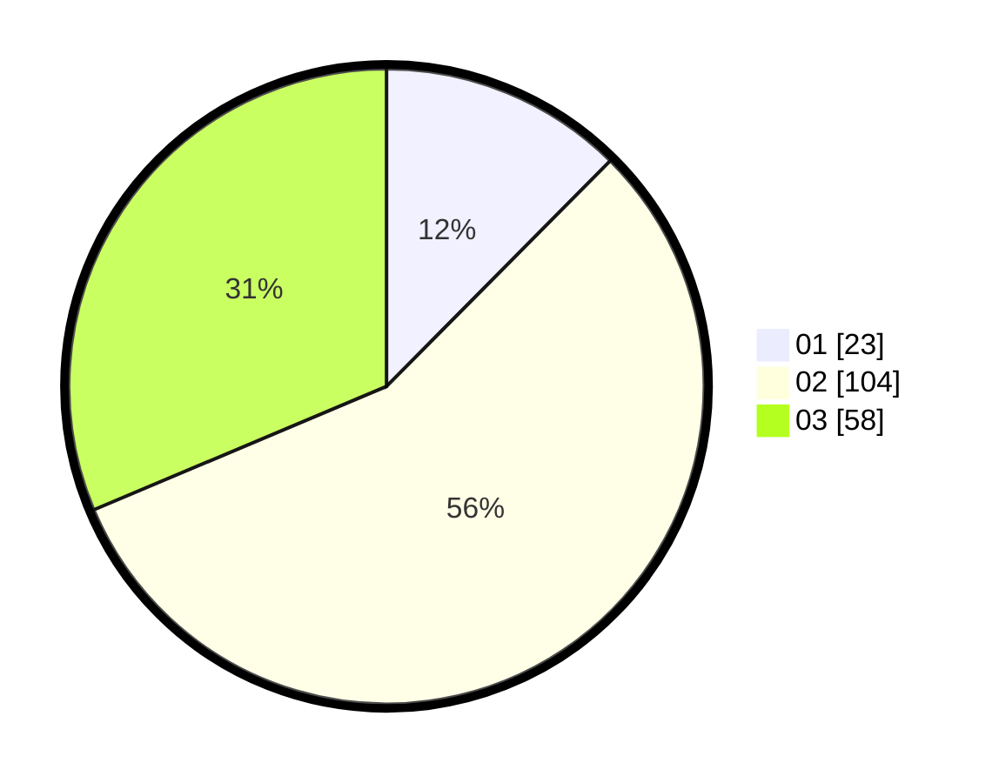

# Hasil

Hasil perolehan suara paslon dapat dilihat pada file paslon-01.txt, paslon-02.txt, dan paslon-03.txt.

Jika tidak ada, artinya data tersebut belum ada pada SIREKAP.

## Perolehan Suara

 * Paslon 01: **23**.
 * Paslon 02: **104**.
 * Paslon 03: **58**.

## Foto C Plano

https://sirekap-obj-formc.kpu.go.id/d480/pemilu/ppwp/31/71/02/10/04/3171021004005-20240216-092335--9257140d-259b-488e-bebd-bb96c863e1b8.jpg

https://sirekap-obj-formc.kpu.go.id/d480/pemilu/ppwp/31/71/02/10/04/3171021004005-20240216-092336--b88344d8-f7e9-4724-b57d-f2cfe967926a.jpg

https://sirekap-obj-formc.kpu.go.id/d480/pemilu/ppwp/31/71/02/10/04/3171021004005-20240216-092335--c008a297-8d80-4d21-8fef-a796929564f1.jpg

## DATA PEMILIH TETAP

Jumlah pemilih dalam DPT: **277**.
 * L: **133**.
 * P: **144**.

## DATA PENGGUNA HAK PILIH

Jumlah pengguna hak pilih dalam DPT: **178**.
 * L: **86**.
 * P: **92**.

Jumlah pengguna hak pilih dalam DPTb: **1**.
 * L: **1**.
 * P: **0**.

Jumlah pengguna hak pilih dalam DPK: **7**.
 * L: **3**.
 * P: **4**.

Jumlah pengguna hak pilih: **186**.
 * L: **90**.
 * P: **96**.

## JUMLAH SUARA SAH DAN TIDAK SAH

JUMLAH SELURUH SUARA SAH: **185**.

JUMLAH SUARA TIDAK SAH: **1**.

JUMLAH SELURUH SUARA SAH DAN SUARA TIDAK SAH: **186**.
