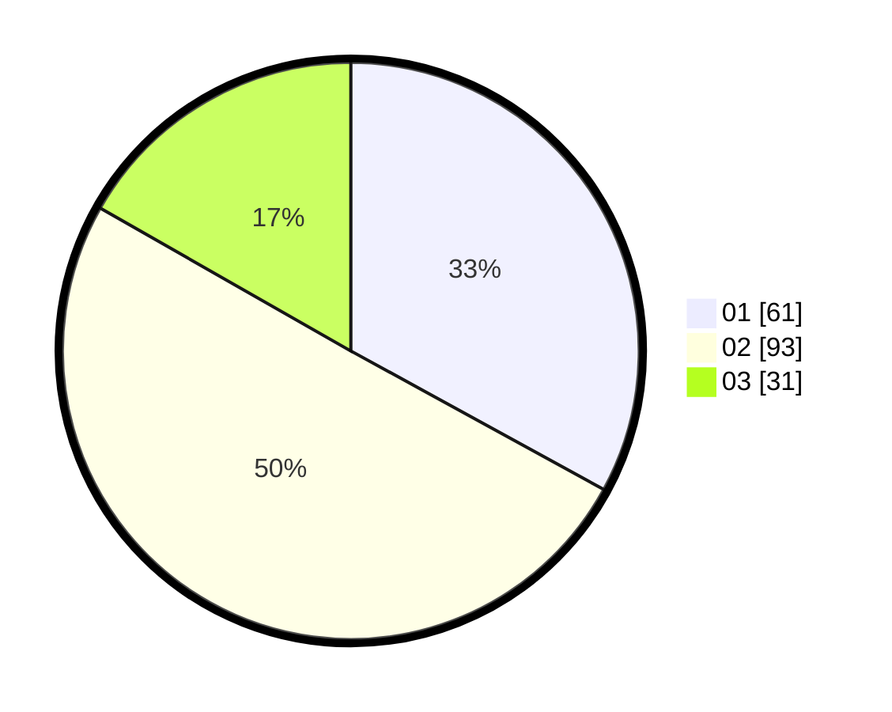

# Hasil

Hasil perolehan suara paslon dapat dilihat pada file paslon-01.txt, paslon-02.txt, dan paslon-03.txt.

Jika tidak ada, artinya data tersebut belum ada pada SIREKAP.

## Perolehan Suara

 * Paslon 01: **61**.
 * Paslon 02: **93**.
 * Paslon 03: **31**.

## Foto C Plano

https://sirekap-obj-formc.kpu.go.id/ff73/pemilu/ppwp/31/71/02/10/04/3171021004009-20240215-111003--73ade983-0e1f-4e00-a005-2c18451ba4b2.jpg

https://sirekap-obj-formc.kpu.go.id/ff73/pemilu/ppwp/31/71/02/10/04/3171021004009-20240215-111024--855d5986-4757-470f-86ed-e18df4f6344d.jpg

https://sirekap-obj-formc.kpu.go.id/ff73/pemilu/ppwp/31/71/02/10/04/3171021004009-20240215-111013--3e4a697d-ac4c-462b-b5a3-5f7b1b11f810.jpg

## DATA PEMILIH TETAP

Jumlah pemilih dalam DPT: **275**.
 * L: **144**.
 * P: **131**.

## DATA PENGGUNA HAK PILIH

Jumlah pengguna hak pilih dalam DPT: **188**.
 * L: **105**.
 * P: **83**.

Jumlah pengguna hak pilih dalam DPTb: **0**.
 * L: **0**.
 * P: **0**.

Jumlah pengguna hak pilih dalam DPK: **3**.
 * L: **0**.
 * P: **3**.

Jumlah pengguna hak pilih: **191**.
 * L: **105**.
 * P: **86**.

## JUMLAH SUARA SAH DAN TIDAK SAH

JUMLAH SELURUH SUARA SAH: **185**.

JUMLAH SUARA TIDAK SAH: **6**.

JUMLAH SELURUH SUARA SAH DAN SUARA TIDAK SAH: **191**.
