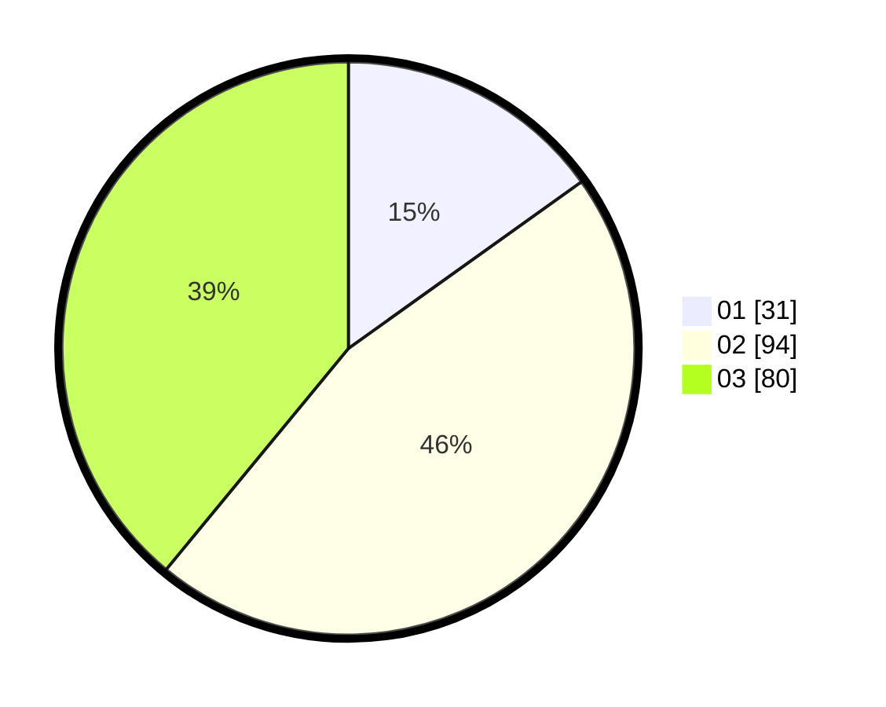

# Hasil

Hasil perolehan suara paslon dapat dilihat pada file paslon-01.txt, paslon-02.txt, dan paslon-03.txt.

Jika tidak ada, artinya data tersebut belum ada pada SIREKAP.

## Perolehan Suara

 * Paslon 01: **31**.
 * Paslon 02: **94**.
 * Paslon 03: **80**.

## Foto C Plano

https://sirekap-obj-formc.kpu.go.id/6379/pemilu/ppwp/31/71/02/10/04/3171021004015-20240216-050200--f46d2a59-8d32-46c7-96b2-2eb301eac039.jpg

https://sirekap-obj-formc.kpu.go.id/6379/pemilu/ppwp/31/71/02/10/04/3171021004015-20240216-050209--15522244-c7ab-455c-9562-72d6c72d4f24.jpg

https://sirekap-obj-formc.kpu.go.id/6379/pemilu/ppwp/31/71/02/10/04/3171021004015-20240216-050208--efb6ffcd-647b-4d58-9a38-944fec3dab15.jpg

## DATA PEMILIH TETAP

Jumlah pemilih dalam DPT: **268**.
 * L: **121**.
 * P: **147**.

## DATA PENGGUNA HAK PILIH

Jumlah pengguna hak pilih dalam DPT: **188**.
 * L: **81**.
 * P: **107**.

Jumlah pengguna hak pilih dalam DPTb: **11**.
 * L: **5**.
 * P: **6**.

Jumlah pengguna hak pilih dalam DPK: **7**.
 * L: **3**.
 * P: **4**.

Jumlah pengguna hak pilih: **206**.
 * L: **89**.
 * P: **117**.

## JUMLAH SUARA SAH DAN TIDAK SAH

JUMLAH SELURUH SUARA SAH: **205**.

JUMLAH SUARA TIDAK SAH: **1**.

JUMLAH SELURUH SUARA SAH DAN SUARA TIDAK SAH: **206**.
