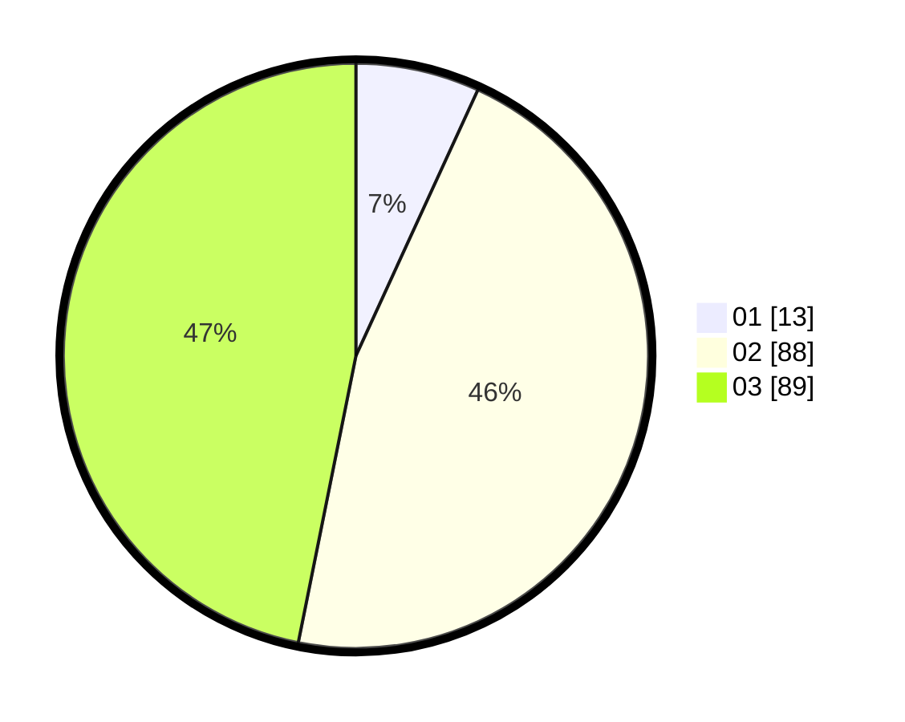

# Hasil

Hasil perolehan suara paslon dapat dilihat pada file paslon-01.txt, paslon-02.txt, dan paslon-03.txt.

Jika tidak ada, artinya data tersebut belum ada pada SIREKAP.

## Perolehan Suara

 * Paslon 01: **13**.
 * Paslon 02: **88**.
 * Paslon 03: **89**.

## Foto C Plano

https://sirekap-obj-formc.kpu.go.id/6a14/pemilu/ppwp/31/71/02/10/04/3171021004016-20240214-155127--a3c585ff-2533-4d90-b22c-1afed05ec21f.jpg

https://sirekap-obj-formc.kpu.go.id/6a14/pemilu/ppwp/31/71/02/10/04/3171021004016-20240214-155134--37059653-06bb-46b3-9bc7-1cc0d2949abe.jpg

https://sirekap-obj-formc.kpu.go.id/6a14/pemilu/ppwp/31/71/02/10/04/3171021004016-20240214-155139--bc5afeba-bacc-4b6f-a656-f2a527bfbbf8.jpg

## DATA PEMILIH TETAP

Jumlah pemilih dalam DPT: **279**.
 * L: **134**.
 * P: **145**.

## DATA PENGGUNA HAK PILIH

Jumlah pengguna hak pilih dalam DPT: **188**.
 * L: **84**.
 * P: **104**.

Jumlah pengguna hak pilih dalam DPTb: **2**.
 * L: **1**.
 * P: **1**.

Jumlah pengguna hak pilih dalam DPK: **0**.
 * L: **0**.
 * P: **0**.

Jumlah pengguna hak pilih: **190**.
 * L: **85**.
 * P: **105**.

## JUMLAH SUARA SAH DAN TIDAK SAH

JUMLAH SELURUH SUARA SAH: **190**.

JUMLAH SUARA TIDAK SAH: **0**.

JUMLAH SELURUH SUARA SAH DAN SUARA TIDAK SAH: **190**.
