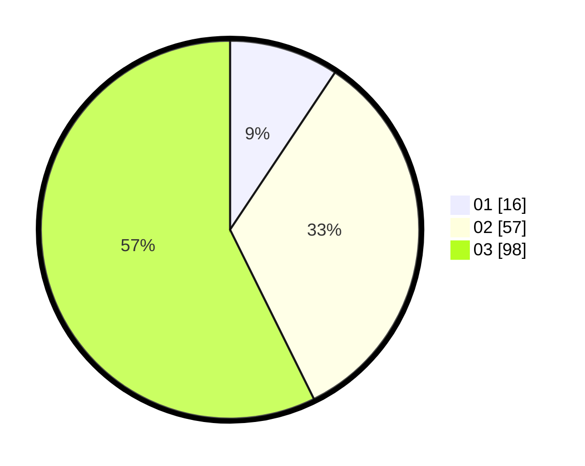

# Hasil

Hasil perolehan suara paslon dapat dilihat pada file paslon-01.txt, paslon-02.txt, dan paslon-03.txt.

Jika tidak ada, artinya data tersebut belum ada pada SIREKAP.

## Perolehan Suara

 * Paslon 01: **16**.
 * Paslon 02: **57**.
 * Paslon 03: **98**.

## Foto C Plano

https://sirekap-obj-formc.kpu.go.id/0443/pemilu/ppwp/31/71/02/10/04/3171021004018-20240216-130531--9f68042b-7ba5-4f87-b5f9-806010520033.jpg

https://sirekap-obj-formc.kpu.go.id/0443/pemilu/ppwp/31/71/02/10/04/3171021004018-20240216-130532--cfe6bd9c-176c-4274-b1a1-da305c721c8d.jpg

https://sirekap-obj-formc.kpu.go.id/0443/pemilu/ppwp/31/71/02/10/04/3171021004018-20240216-130532--4b8429dd-732c-41ae-993e-1189fc79be5b.jpg

## DATA PEMILIH TETAP

Jumlah pemilih dalam DPT: **249**.
 * L: **127**.
 * P: **122**.

## DATA PENGGUNA HAK PILIH

Jumlah pengguna hak pilih dalam DPT: **167**.
 * L: **84**.
 * P: **83**.

Jumlah pengguna hak pilih dalam DPTb: **4**.
 * L: **1**.
 * P: **3**.

Jumlah pengguna hak pilih dalam DPK: **2**.
 * L: **1**.
 * P: **1**.

Jumlah pengguna hak pilih: **173**.
 * L: **86**.
 * P: **87**.

## JUMLAH SUARA SAH DAN TIDAK SAH

JUMLAH SELURUH SUARA SAH: **171**.

JUMLAH SUARA TIDAK SAH: **2**.

JUMLAH SELURUH SUARA SAH DAN SUARA TIDAK SAH: **173**.
