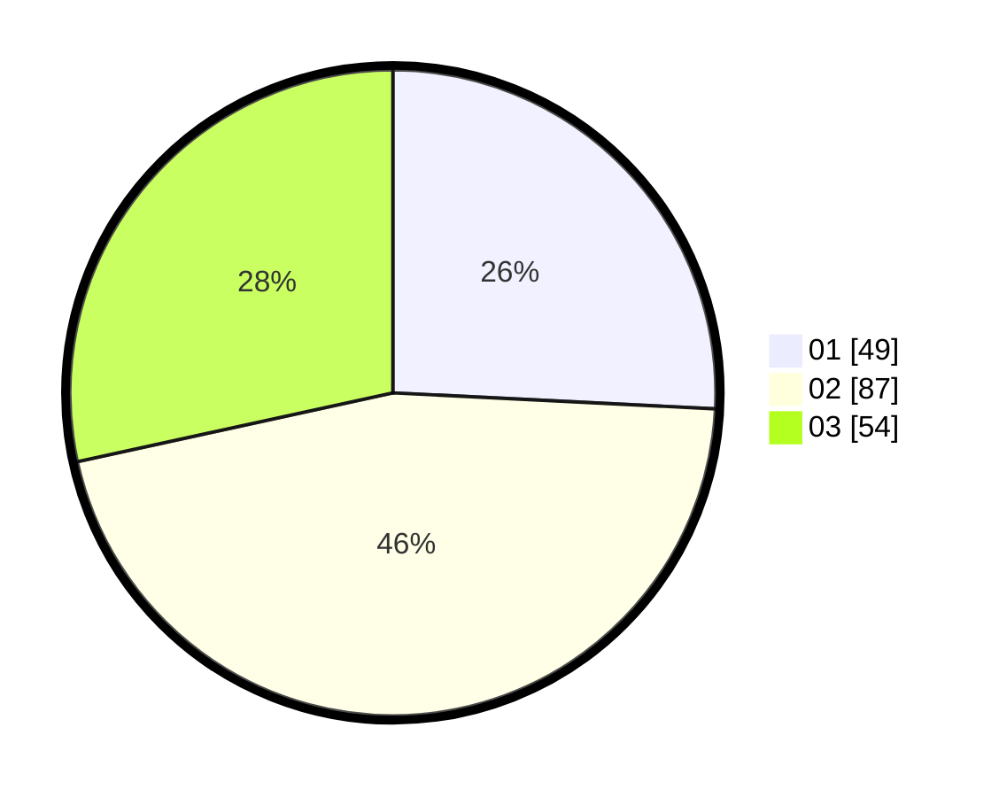

# Hasil

Hasil perolehan suara paslon dapat dilihat pada file paslon-01.txt, paslon-02.txt, dan paslon-03.txt.

Jika tidak ada, artinya data tersebut belum ada pada SIREKAP.

## Perolehan Suara

 * Paslon 01: **49**.
 * Paslon 02: **87**.
 * Paslon 03: **54**.

## Foto C Plano

https://sirekap-obj-formc.kpu.go.id/7080/pemilu/ppwp/31/71/02/10/04/3171021004020-20240214-155025--73e7b187-9715-4ecc-b13b-cd2879c90436.jpg

https://sirekap-obj-formc.kpu.go.id/7080/pemilu/ppwp/31/71/02/10/04/3171021004020-20240214-155438--2e3e4145-7a78-44ab-9ca5-159417013af4.jpg

https://sirekap-obj-formc.kpu.go.id/7080/pemilu/ppwp/31/71/02/10/04/3171021004020-20240214-155747--a6bfd9f9-86b0-4bfc-8d93-14287282bb7a.jpg

## DATA PEMILIH TETAP

Jumlah pemilih dalam DPT: **286**.
 * L: **146**.
 * P: **140**.

## DATA PENGGUNA HAK PILIH

Jumlah pengguna hak pilih dalam DPT: **194**.
 * L: **94**.
 * P: **100**.

Jumlah pengguna hak pilih dalam DPTb: **0**.
 * L: **0**.
 * P: **0**.

Jumlah pengguna hak pilih dalam DPK: **0**.
 * L: **0**.
 * P: **0**.

Jumlah pengguna hak pilih: **194**.
 * L: **94**.
 * P: **100**.

## JUMLAH SUARA SAH DAN TIDAK SAH

JUMLAH SELURUH SUARA SAH: **190**.

JUMLAH SUARA TIDAK SAH: **4**.

JUMLAH SELURUH SUARA SAH DAN SUARA TIDAK SAH: **194**.
