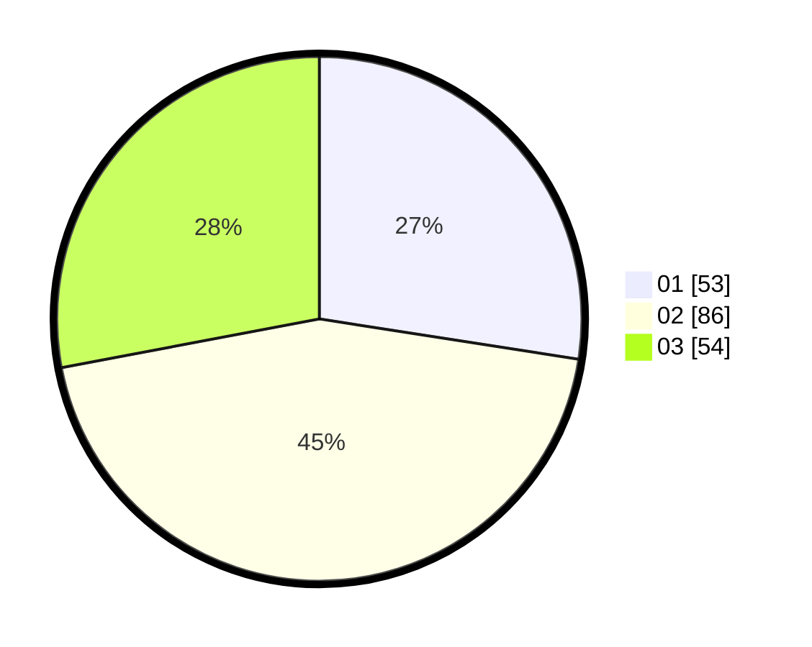

# Hasil

Hasil perolehan suara paslon dapat dilihat pada file paslon-01.txt, paslon-02.txt, dan paslon-03.txt.

Jika tidak ada, artinya data tersebut belum ada pada SIREKAP.

## Perolehan Suara

 * Paslon 01: **53**.
 * Paslon 02: **86**.
 * Paslon 03: **54**.

## Foto C Plano

https://sirekap-obj-formc.kpu.go.id/80cf/pemilu/ppwp/31/71/02/10/04/3171021004023-20240215-023108--4704d452-8ca0-4fc0-aef8-33e5cf0ea602.jpg

https://sirekap-obj-formc.kpu.go.id/80cf/pemilu/ppwp/31/71/02/10/04/3171021004023-20240215-023213--c7efad74-91b5-4041-99a8-5ded75758288.jpg

https://sirekap-obj-formc.kpu.go.id/80cf/pemilu/ppwp/31/71/02/10/04/3171021004023-20240214-205335--deae8bd3-5176-4648-9603-847d5248fe2d.jpg
