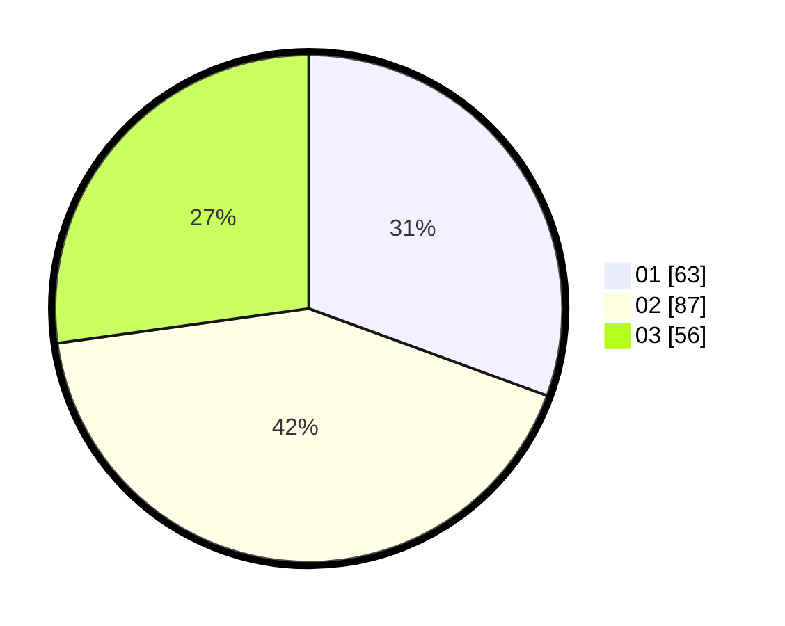

# Hasil

Hasil perolehan suara paslon dapat dilihat pada file paslon-01.txt, paslon-02.txt, dan paslon-03.txt.

Jika tidak ada, artinya data tersebut belum ada pada SIREKAP.

## Perolehan Suara

 * Paslon 01: **63**.
 * Paslon 02: **87**.
 * Paslon 03: **56**.

## Foto C Plano

https://sirekap-obj-formc.kpu.go.id/a736/pemilu/ppwp/31/71/02/10/04/3171021004027-20240216-020244--dadcaf29-cb3b-494c-9b2b-4a685967bad7.jpg

https://sirekap-obj-formc.kpu.go.id/a736/pemilu/ppwp/31/71/02/10/04/3171021004027-20240216-020246--be2a1d9b-95f5-416e-b443-43d7e5d79288.jpg

https://sirekap-obj-formc.kpu.go.id/a736/pemilu/ppwp/31/71/02/10/04/3171021004027-20240216-020245--a1ed503b-5587-4378-822c-2adca8a721af.jpg

## DATA PEMILIH TETAP

Jumlah pemilih dalam DPT: **266**.
 * L: **130**.
 * P: **136**.

## DATA PENGGUNA HAK PILIH

Jumlah pengguna hak pilih dalam DPT: **206**.
 * L: **93**.
 * P: **113**.

Jumlah pengguna hak pilih dalam DPTb: **2**.
 * L: **1**.
 * P: **1**.

Jumlah pengguna hak pilih dalam DPK: **3**.
 * L: **1**.
 * P: **2**.

Jumlah pengguna hak pilih: **211**.
 * L: **95**.
 * P: **116**.

## JUMLAH SUARA SAH DAN TIDAK SAH

JUMLAH SELURUH SUARA SAH: **206**.

JUMLAH SUARA TIDAK SAH: **5**.

JUMLAH SELURUH SUARA SAH DAN SUARA TIDAK SAH: **211**.
