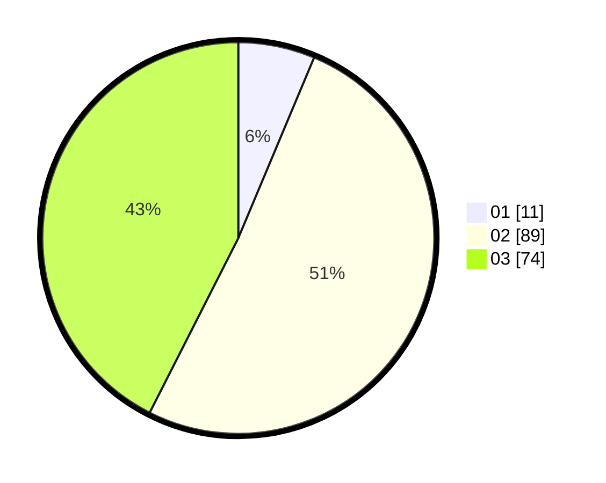

# Hasil

Hasil perolehan suara paslon dapat dilihat pada file paslon-01.txt, paslon-02.txt, dan paslon-03.txt.

Jika tidak ada, artinya data tersebut belum ada pada SIREKAP.

## Perolehan Suara

 * Paslon 01: **11**.
 * Paslon 02: **89**.
 * Paslon 03: **74**.

## Foto C Plano

https://sirekap-obj-formc.kpu.go.id/ea5f/pemilu/ppwp/31/71/02/10/04/3171021004029-20240216-045801--9f5e862f-8ba9-492b-9f7b-ad393b40e29c.jpg

https://sirekap-obj-formc.kpu.go.id/ea5f/pemilu/ppwp/31/71/02/10/04/3171021004029-20240214-184455--37f22c12-ab25-484c-a027-16a04426733f.jpg

https://sirekap-obj-formc.kpu.go.id/ea5f/pemilu/ppwp/31/71/02/10/04/3171021004029-20240214-184555--61fccbfa-4ccb-4a69-b97e-40507aa0a3bc.jpg

## DATA PEMILIH TETAP

Jumlah pemilih dalam DPT: **268**.
 * L: **126**.
 * P: **142**.

## DATA PENGGUNA HAK PILIH

Jumlah pengguna hak pilih dalam DPT: **168**.
 * L: **73**.
 * P: **95**.

Jumlah pengguna hak pilih dalam DPTb: **4**.
 * L: **1**.
 * P: **3**.

Jumlah pengguna hak pilih dalam DPK: **4**.
 * L: **2**.
 * P: **2**.

Jumlah pengguna hak pilih: **176**.
 * L: **76**.
 * P: **100**.

## JUMLAH SUARA SAH DAN TIDAK SAH

JUMLAH SELURUH SUARA SAH: **174**.

JUMLAH SUARA TIDAK SAH: **2**.

JUMLAH SELURUH SUARA SAH DAN SUARA TIDAK SAH: **176**.
