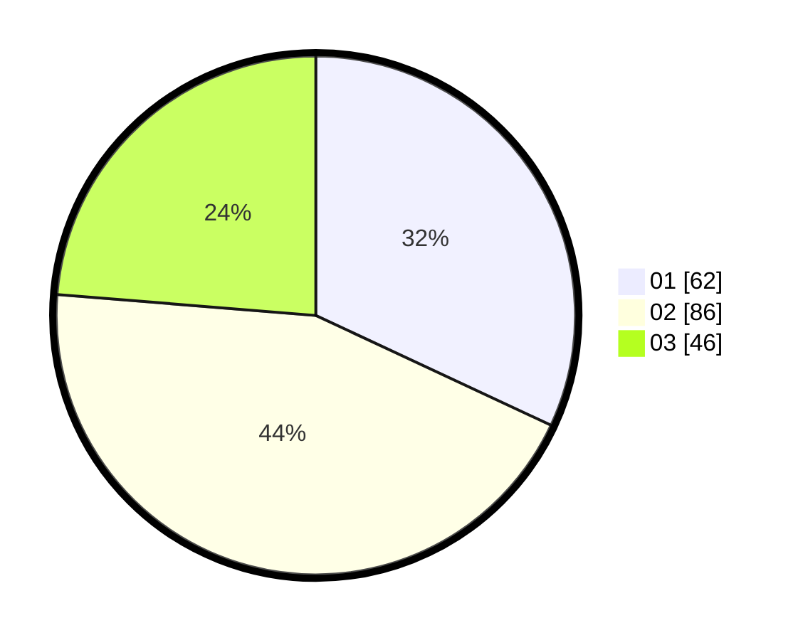

# Hasil

Hasil perolehan suara paslon dapat dilihat pada file paslon-01.txt, paslon-02.txt, dan paslon-03.txt.

Jika tidak ada, artinya data tersebut belum ada pada SIREKAP.

## Perolehan Suara

 * Paslon 01: **62**.
 * Paslon 02: **86**.
 * Paslon 03: **46**.

## Foto C Plano

https://sirekap-obj-formc.kpu.go.id/9441/pemilu/ppwp/31/71/02/10/04/3171021004032-20240216-184400--1bdbfa74-837d-43e3-abca-8eaa9058704e.jpg

https://sirekap-obj-formc.kpu.go.id/9441/pemilu/ppwp/31/71/02/10/04/3171021004032-20240216-184402--cf43dc89-5804-4073-946d-e9ee4698328e.jpg

https://sirekap-obj-formc.kpu.go.id/9441/pemilu/ppwp/31/71/02/10/04/3171021004032-20240216-184401--45d34a39-3c9f-48d3-9590-bcdc44cfd08c.jpg

## DATA PEMILIH TETAP

Jumlah pemilih dalam DPT: **270**.
 * L: **139**.
 * P: **131**.

## DATA PENGGUNA HAK PILIH

Jumlah pengguna hak pilih dalam DPT: **187**.
 * L: **96**.
 * P: **91**.

Jumlah pengguna hak pilih dalam DPTb: **7**.
 * L: **3**.
 * P: **4**.

Jumlah pengguna hak pilih dalam DPK: **1**.
 * L: **1**.
 * P: **0**.

Jumlah pengguna hak pilih: **195**.
 * L: **100**.
 * P: **95**.

## JUMLAH SUARA SAH DAN TIDAK SAH

JUMLAH SELURUH SUARA SAH: **194**.

JUMLAH SUARA TIDAK SAH: **1**.

JUMLAH SELURUH SUARA SAH DAN SUARA TIDAK SAH: **195**.
