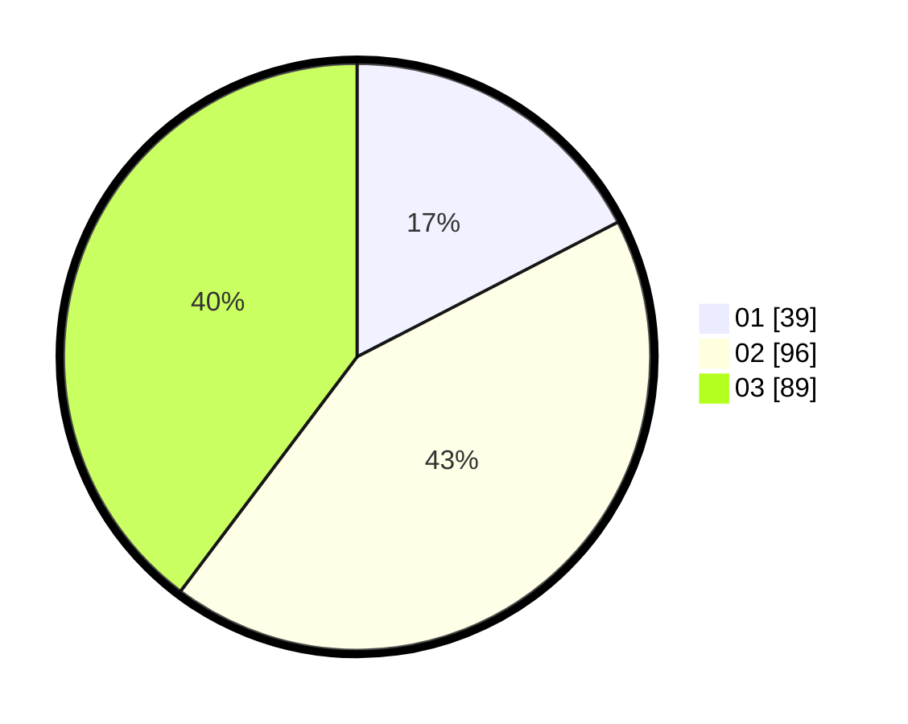

# Hasil

Hasil perolehan suara paslon dapat dilihat pada file paslon-01.txt, paslon-02.txt, dan paslon-03.txt.

Jika tidak ada, artinya data tersebut belum ada pada SIREKAP.

## Perolehan Suara

 * Paslon 01: **39**.
 * Paslon 02: **96**.
 * Paslon 03: **89**.

## Foto C Plano

https://sirekap-obj-formc.kpu.go.id/e839/pemilu/ppwp/31/71/02/10/04/3171021004035-20240214-155704--818b33c5-e503-440e-bd83-f604de6ed2ab.jpg

https://sirekap-obj-formc.kpu.go.id/e839/pemilu/ppwp/31/71/02/10/04/3171021004035-20240214-155755--614a10fa-ed57-4164-b9ac-9d8c85521545.jpg

https://sirekap-obj-formc.kpu.go.id/e839/pemilu/ppwp/31/71/02/10/04/3171021004035-20240214-155816--f0ececdf-9b6c-4759-9d5c-9391e2bac9f9.jpg

## DATA PEMILIH TETAP

Jumlah pemilih dalam DPT: **286**.
 * L: **128**.
 * P: **158**.

## DATA PENGGUNA HAK PILIH

Jumlah pengguna hak pilih dalam DPT: **220**.
 * L: **126**.
 * P: **94**.

Jumlah pengguna hak pilih dalam DPTb: **3**.
 * L: **2**.
 * P: **1**.

Jumlah pengguna hak pilih dalam DPK: **3**.
 * L: **1**.
 * P: **2**.

Jumlah pengguna hak pilih: **226**.
 * L: **129**.
 * P: **97**.

## JUMLAH SUARA SAH DAN TIDAK SAH

JUMLAH SELURUH SUARA SAH: **224**.

JUMLAH SUARA TIDAK SAH: **2**.

JUMLAH SELURUH SUARA SAH DAN SUARA TIDAK SAH: **226**.
