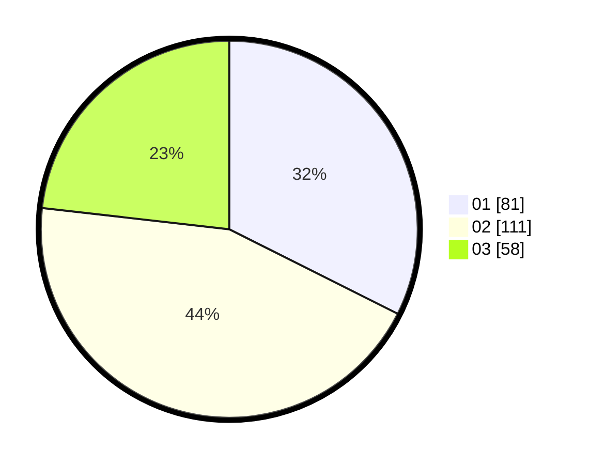

# Hasil

Hasil perolehan suara paslon dapat dilihat pada file paslon-01.txt, paslon-02.txt, dan paslon-03.txt.

Jika tidak ada, artinya data tersebut belum ada pada SIREKAP.

## Perolehan Suara

 * Paslon 01: **81**.
 * Paslon 02: **111**.
 * Paslon 03: **58**.

## Foto C Plano

https://sirekap-obj-formc.kpu.go.id/2efb/pemilu/ppwp/31/71/02/10/04/3171021004036-20240216-132046--539ab7c3-7afd-470c-ba22-a0dd2e67b50d.jpg

https://sirekap-obj-formc.kpu.go.id/2efb/pemilu/ppwp/31/71/02/10/04/3171021004036-20240216-132047--75678123-a829-451a-9dfe-0fcd812f24b6.jpg

https://sirekap-obj-formc.kpu.go.id/2efb/pemilu/ppwp/31/71/02/10/04/3171021004036-20240216-132046--25273b1e-9785-4736-813c-53b4682ab03a.jpg

## DATA PEMILIH TETAP

Jumlah pemilih dalam DPT: **283**.
 * L: **137**.
 * P: **146**.

## DATA PENGGUNA HAK PILIH

Jumlah pengguna hak pilih dalam DPT: **231**.
 * L: **108**.
 * P: **123**.

Jumlah pengguna hak pilih dalam DPTb: **19**.
 * L: **10**.
 * P: **9**.

Jumlah pengguna hak pilih dalam DPK: **2**.
 * L: **2**.
 * P: **0**.

Jumlah pengguna hak pilih: **252**.
 * L: **120**.
 * P: **132**.

## JUMLAH SUARA SAH DAN TIDAK SAH

JUMLAH SELURUH SUARA SAH: **250**.

JUMLAH SUARA TIDAK SAH: **2**.

JUMLAH SELURUH SUARA SAH DAN SUARA TIDAK SAH: **252**.
