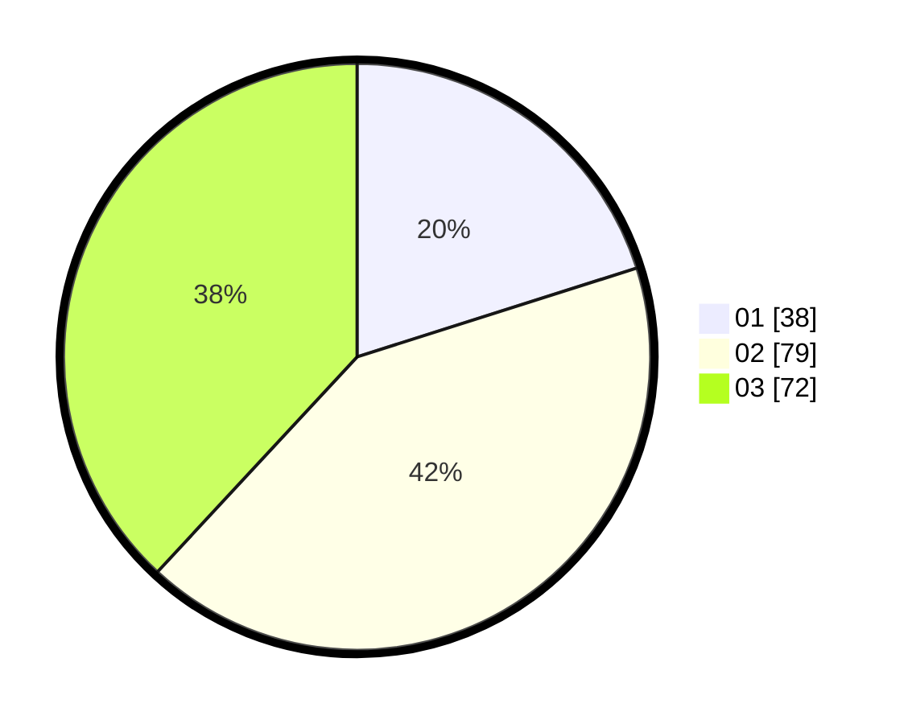

# Hasil

Hasil perolehan suara paslon dapat dilihat pada file paslon-01.txt, paslon-02.txt, dan paslon-03.txt.

Jika tidak ada, artinya data tersebut belum ada pada SIREKAP.

## Perolehan Suara

 * Paslon 01: **38**.
 * Paslon 02: **79**.
 * Paslon 03: **72**.

## Foto C Plano

https://sirekap-obj-formc.kpu.go.id/da33/pemilu/ppwp/31/71/02/10/04/3171021004039-20240214-155049--1b26f953-ca7c-4bfa-bdee-68b21d88dabf.jpg

https://sirekap-obj-formc.kpu.go.id/da33/pemilu/ppwp/31/71/02/10/04/3171021004039-20240214-155052--a4c5816b-5d17-43e8-8834-37c86f31fea7.jpg

https://sirekap-obj-formc.kpu.go.id/da33/pemilu/ppwp/31/71/02/10/04/3171021004039-20240214-155040--08806cc0-b627-4464-adf4-56e82ad29e57.jpg

## DATA PEMILIH TETAP

Jumlah pemilih dalam DPT: **251**.
 * L: **122**.
 * P: **129**.

## DATA PENGGUNA HAK PILIH

Jumlah pengguna hak pilih dalam DPT: **188**.
 * L: **95**.
 * P: **93**.

Jumlah pengguna hak pilih dalam DPTb: **2**.
 * L: **1**.
 * P: **1**.

Jumlah pengguna hak pilih dalam DPK: **1**.
 * L: **1**.
 * P: **0**.

Jumlah pengguna hak pilih: **191**.
 * L: **97**.
 * P: **94**.

## JUMLAH SUARA SAH DAN TIDAK SAH

JUMLAH SELURUH SUARA SAH: **189**.

JUMLAH SUARA TIDAK SAH: **2**.

JUMLAH SELURUH SUARA SAH DAN SUARA TIDAK SAH: **191**.
