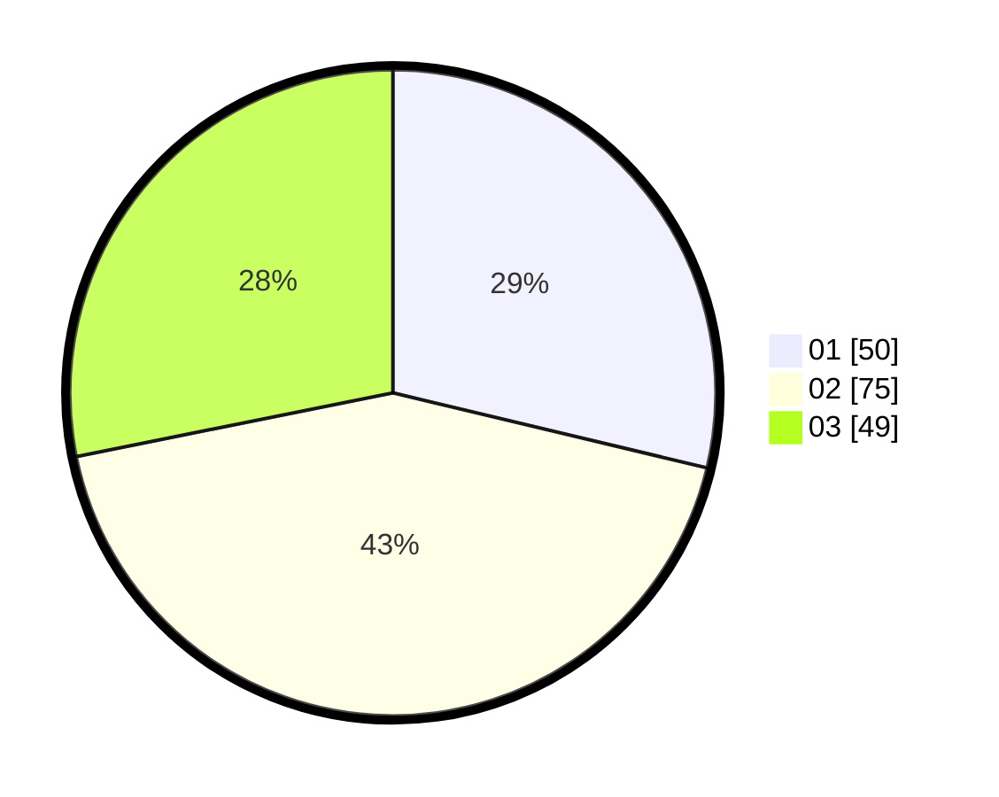

# Hasil

Hasil perolehan suara paslon dapat dilihat pada file paslon-01.txt, paslon-02.txt, dan paslon-03.txt.

Jika tidak ada, artinya data tersebut belum ada pada SIREKAP.

## Perolehan Suara

 * Paslon 01: **50**.
 * Paslon 02: **75**.
 * Paslon 03: **49**.

## Foto C Plano

https://sirekap-obj-formc.kpu.go.id/47a2/pemilu/ppwp/31/71/02/10/04/3171021004040-20240215-044239--c5a6a1e1-d033-4a8b-afc5-58a4be9f192e.jpg

https://sirekap-obj-formc.kpu.go.id/47a2/pemilu/ppwp/31/71/02/10/04/3171021004040-20240215-044300--3e379056-c9b0-41ea-adaf-ed7bd3d5f00f.jpg

https://sirekap-obj-formc.kpu.go.id/47a2/pemilu/ppwp/31/71/02/10/04/3171021004040-20240215-044249--f0bb01c8-8276-4fab-a2bc-8136ccb3f1f9.jpg

## DATA PEMILIH TETAP

Jumlah pemilih dalam DPT: **254**.
 * L: **128**.
 * P: **126**.

## DATA PENGGUNA HAK PILIH

Jumlah pengguna hak pilih dalam DPT: **175**.
 * L: **84**.
 * P: **91**.

Jumlah pengguna hak pilih dalam DPTb: **2**.
 * L: **0**.
 * P: **2**.

Jumlah pengguna hak pilih dalam DPK: **0**.
 * L: **0**.
 * P: **0**.

Jumlah pengguna hak pilih: **177**.
 * L: **84**.
 * P: **93**.

## JUMLAH SUARA SAH DAN TIDAK SAH

JUMLAH SELURUH SUARA SAH: **174**.

JUMLAH SUARA TIDAK SAH: **3**.

JUMLAH SELURUH SUARA SAH DAN SUARA TIDAK SAH: **177**.
