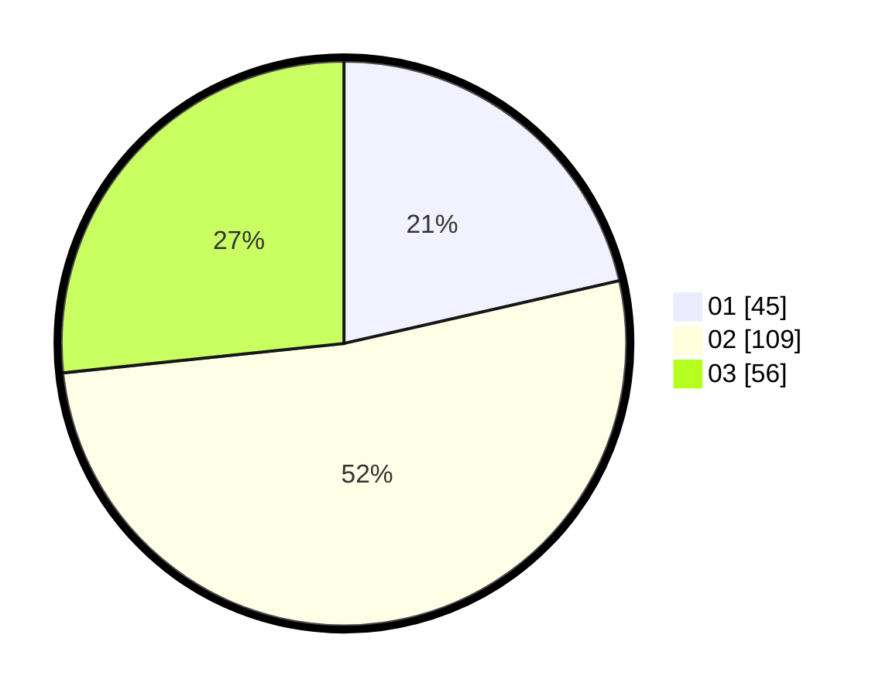

# Hasil

Hasil perolehan suara paslon dapat dilihat pada file paslon-01.txt, paslon-02.txt, dan paslon-03.txt.

Jika tidak ada, artinya data tersebut belum ada pada SIREKAP.

## Perolehan Suara

 * Paslon 01: **45**.
 * Paslon 02: **109**.
 * Paslon 03: **56**.

## Foto C Plano

https://sirekap-obj-formc.kpu.go.id/d026/pemilu/ppwp/31/71/02/10/04/3171021004042-20240214-204610--ce1fdeca-80e3-4ae1-a059-51719840c3ad.jpg

https://sirekap-obj-formc.kpu.go.id/d026/pemilu/ppwp/31/71/02/10/04/3171021004042-20240214-235747--4c8711ea-2654-47d7-ab81-847e8657cfe5.jpg

https://sirekap-obj-formc.kpu.go.id/d026/pemilu/ppwp/31/71/02/10/04/3171021004042-20240214-204214--c4f55f32-d16a-4d40-b43b-9726b888296a.jpg

## DATA PEMILIH TETAP

Jumlah pemilih dalam DPT: **283**.
 * L: **129**.
 * P: **154**.

## DATA PENGGUNA HAK PILIH

Jumlah pengguna hak pilih dalam DPT: **206**.
 * L: **87**.
 * P: **119**.

Jumlah pengguna hak pilih dalam DPTb: **3**.
 * L: **1**.
 * P: **2**.

Jumlah pengguna hak pilih dalam DPK: **1**.
 * L: **0**.
 * P: **1**.

Jumlah pengguna hak pilih: **210**.
 * L: **88**.
 * P: **122**.

## JUMLAH SUARA SAH DAN TIDAK SAH

JUMLAH SELURUH SUARA SAH: **210**.

JUMLAH SUARA TIDAK SAH: **0**.

JUMLAH SELURUH SUARA SAH DAN SUARA TIDAK SAH: **210**.
