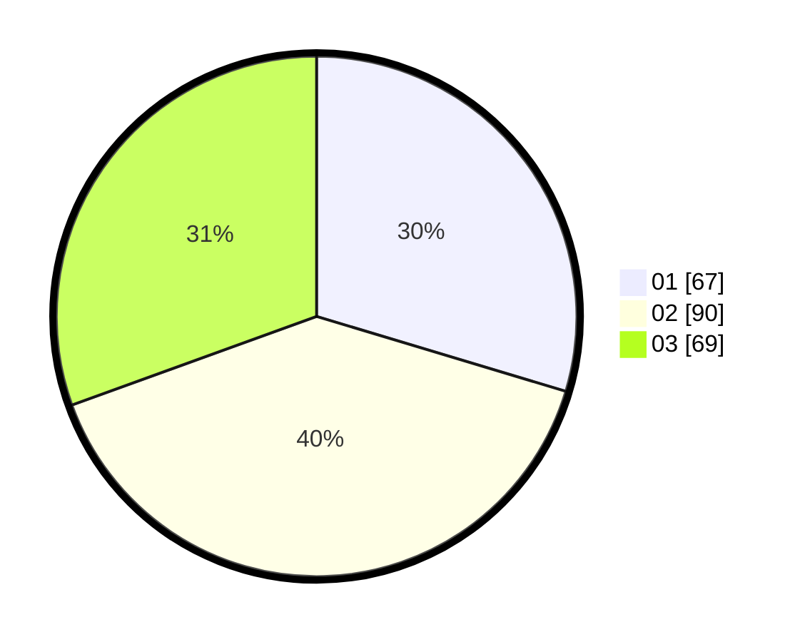

# Hasil

Hasil perolehan suara paslon dapat dilihat pada file paslon-01.txt, paslon-02.txt, dan paslon-03.txt.

Jika tidak ada, artinya data tersebut belum ada pada SIREKAP.

## Perolehan Suara

 * Paslon 01: **67**.
 * Paslon 02: **90**.
 * Paslon 03: **69**.

## Foto C Plano

https://sirekap-obj-formc.kpu.go.id/50d8/pemilu/ppwp/31/71/02/10/04/3171021004044-20240214-194239--4dba0464-eabe-47b0-b6b7-97d829a6b085.jpg

https://sirekap-obj-formc.kpu.go.id/50d8/pemilu/ppwp/31/71/02/10/04/3171021004044-20240214-200337--d71079e2-38d5-46d1-a26b-7ac88bdf1b9e.jpg

https://sirekap-obj-formc.kpu.go.id/50d8/pemilu/ppwp/31/71/02/10/04/3171021004044-20240214-200537--e50e37d0-8c69-46e6-91be-90c08124c458.jpg

## DATA PEMILIH TETAP

Jumlah pemilih dalam DPT: **288**.
 * L: **140**.
 * P: **148**.

## DATA PENGGUNA HAK PILIH

Jumlah pengguna hak pilih dalam DPT: **213**.
 * L: **105**.
 * P: **108**.

Jumlah pengguna hak pilih dalam DPTb: **14**.
 * L: **8**.
 * P: **5**.

Jumlah pengguna hak pilih dalam DPK: **1**.
 * L: **0**.
 * P: **1**.

Jumlah pengguna hak pilih: **228**.
 * L: **113**.
 * P: **115**.

## JUMLAH SUARA SAH DAN TIDAK SAH

JUMLAH SELURUH SUARA SAH: **26**.

JUMLAH SUARA TIDAK SAH: **0**.

JUMLAH SELURUH SUARA SAH DAN SUARA TIDAK SAH: **228**.
