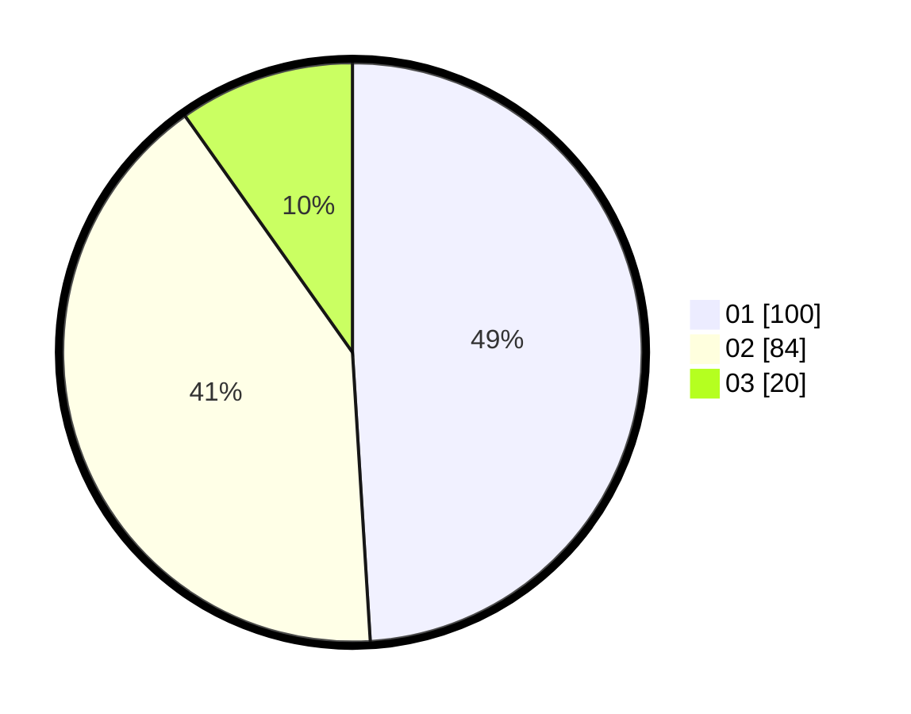

# Hasil

Hasil perolehan suara paslon dapat dilihat pada file paslon-01.txt, paslon-02.txt, dan paslon-03.txt.

Jika tidak ada, artinya data tersebut belum ada pada SIREKAP.

## Perolehan Suara

 * Paslon 01: **100**.
 * Paslon 02: **84**.
 * Paslon 03: **20**.

## Foto C Plano

https://sirekap-obj-formc.kpu.go.id/e206/pemilu/ppwp/31/71/02/10/04/3171021004045-20240216-132747--1e977f6b-32dc-4f5b-99ba-0148794d5a66.jpg

https://sirekap-obj-formc.kpu.go.id/e206/pemilu/ppwp/31/71/02/10/04/3171021004045-20240216-132748--568474dc-3220-4adb-8e77-ece278e78e04.jpg

https://sirekap-obj-formc.kpu.go.id/e206/pemilu/ppwp/31/71/02/10/04/3171021004045-20240216-132747--e9d8d0ad-f7d8-406d-8ff3-9d9c334885ef.jpg

## DATA PEMILIH TETAP

Jumlah pemilih dalam DPT: **261**.
 * L: **129**.
 * P: **132**.

## DATA PENGGUNA HAK PILIH

Jumlah pengguna hak pilih dalam DPT: **207**.
 * L: **101**.
 * P: **106**.

Jumlah pengguna hak pilih dalam DPTb: **1**.
 * L: **0**.
 * P: **1**.

Jumlah pengguna hak pilih dalam DPK: **1**.
 * L: **1**.
 * P: **0**.

Jumlah pengguna hak pilih: **209**.
 * L: **102**.
 * P: **107**.

## JUMLAH SUARA SAH DAN TIDAK SAH

JUMLAH SELURUH SUARA SAH: **204**.

JUMLAH SUARA TIDAK SAH: **5**.

JUMLAH SELURUH SUARA SAH DAN SUARA TIDAK SAH: **209**.
