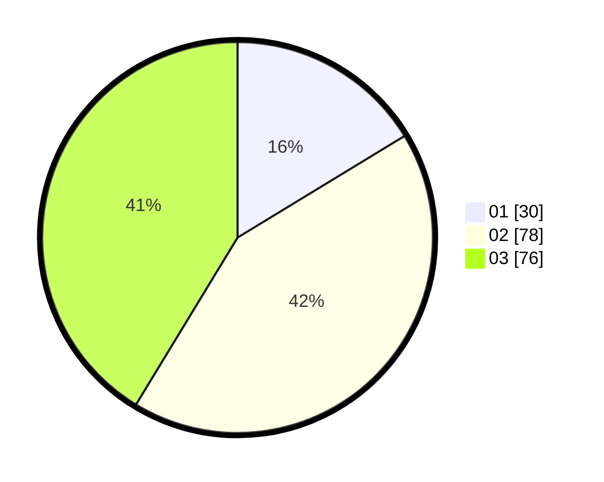

# Hasil

Hasil perolehan suara paslon dapat dilihat pada file paslon-01.txt, paslon-02.txt, dan paslon-03.txt.

Jika tidak ada, artinya data tersebut belum ada pada SIREKAP.

## Perolehan Suara

 * Paslon 01: **30**.
 * Paslon 02: **78**.
 * Paslon 03: **76**.

## Foto C Plano

https://sirekap-obj-formc.kpu.go.id/61ef/pemilu/ppwp/31/71/02/10/04/3171021004046-20240217-113159--e69e19d3-1b03-4289-83a5-dc0e8a4b22f9.jpg

https://sirekap-obj-formc.kpu.go.id/61ef/pemilu/ppwp/31/71/02/10/04/3171021004046-20240214-230906--3c14cada-dd14-4e98-a969-31d7f4127174.jpg

https://sirekap-obj-formc.kpu.go.id/61ef/pemilu/ppwp/31/71/02/10/04/3171021004046-20240217-113200--1f22a23a-1a25-4cca-9551-b2f9bccbca1c.jpg

## DATA PEMILIH TETAP

Jumlah pemilih dalam DPT: **243**.
 * L: **123**.
 * P: **119**.

## DATA PENGGUNA HAK PILIH

Jumlah pengguna hak pilih dalam DPT: **243**.
 * L: **123**.
 * P: **119**.

Jumlah pengguna hak pilih dalam DPTb: **0**.
 * L: **0**.
 * P: **0**.

Jumlah pengguna hak pilih dalam DPK: **2**.
 * L: **0**.
 * P: **2**.

Jumlah pengguna hak pilih: **244**.
 * L: **123**.
 * P: **121**.

## JUMLAH SUARA SAH DAN TIDAK SAH

JUMLAH SELURUH SUARA SAH: **184**.

JUMLAH SUARA TIDAK SAH: **0**.

JUMLAH SELURUH SUARA SAH DAN SUARA TIDAK SAH: **184**.
