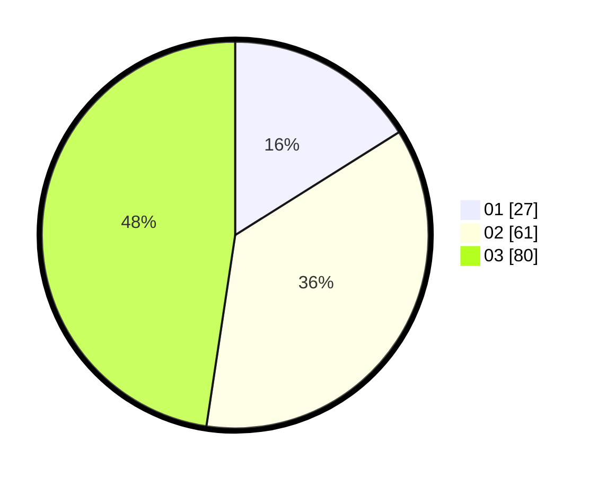

# Hasil

Hasil perolehan suara paslon dapat dilihat pada file paslon-01.txt, paslon-02.txt, dan paslon-03.txt.

Jika tidak ada, artinya data tersebut belum ada pada SIREKAP.

## Perolehan Suara

 * Paslon 01: **27**.
 * Paslon 02: **61**.
 * Paslon 03: **80**.

## Foto C Plano

https://sirekap-obj-formc.kpu.go.id/053e/pemilu/ppwp/31/71/02/10/04/3171021004052-20240215-183026--b3375e95-8676-4922-ab52-bdabd7d40178.jpg

https://sirekap-obj-formc.kpu.go.id/053e/pemilu/ppwp/31/71/02/10/04/3171021004052-20240216-010810--c59069b7-ae20-4abf-9d2e-a360e75642f1.jpg

https://sirekap-obj-formc.kpu.go.id/053e/pemilu/ppwp/31/71/02/10/04/3171021004052-20240215-183027--4a8cd389-fd61-4c9b-9a59-6541df292a00.jpg

## DATA PEMILIH TETAP

Jumlah pemilih dalam DPT: **209**.
 * L: **96**.
 * P: **113**.

## DATA PENGGUNA HAK PILIH

Jumlah pengguna hak pilih dalam DPT: **161**.
 * L: **74**.
 * P: **87**.

Jumlah pengguna hak pilih dalam DPTb: **2**.
 * L: **0**.
 * P: **2**.

Jumlah pengguna hak pilih dalam DPK: **5**.
 * L: **0**.
 * P: **5**.

Jumlah pengguna hak pilih: **168**.
 * L: **74**.
 * P: **94**.

## JUMLAH SUARA SAH DAN TIDAK SAH

JUMLAH SELURUH SUARA SAH: **168**.

JUMLAH SUARA TIDAK SAH: **0**.

JUMLAH SELURUH SUARA SAH DAN SUARA TIDAK SAH: **168**.
