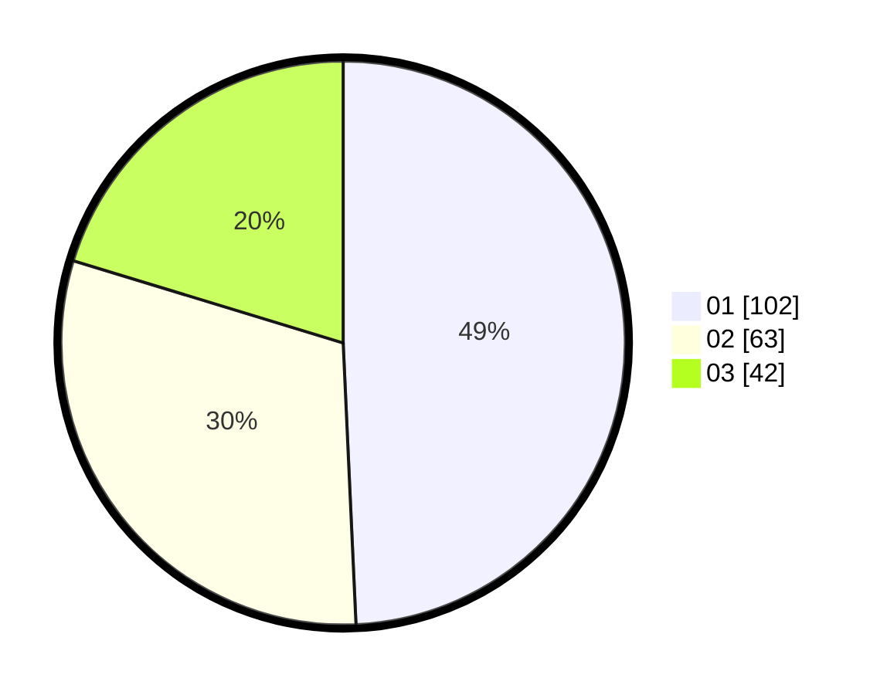

# Hasil

Hasil perolehan suara paslon dapat dilihat pada file paslon-01.txt, paslon-02.txt, dan paslon-03.txt.

Jika tidak ada, artinya data tersebut belum ada pada SIREKAP.

## Perolehan Suara

 * Paslon 01: **102**.
 * Paslon 02: **63**.
 * Paslon 03: **42**.

## Foto C Plano

https://sirekap-obj-formc.kpu.go.id/43ce/pemilu/ppwp/31/71/02/10/04/3171021004055-20240214-185004--e2ab8ff4-2650-4ef4-a777-6d5a6f45bcf6.jpg

https://sirekap-obj-formc.kpu.go.id/43ce/pemilu/ppwp/31/71/02/10/04/3171021004055-20240214-185007--abe98920-1030-44bd-91b6-af867e3612d3.jpg

https://sirekap-obj-formc.kpu.go.id/43ce/pemilu/ppwp/31/71/02/10/04/3171021004055-20240214-185010--27f18da1-7dcc-4fa6-8aac-ff4eb1287ea9.jpg

## DATA PEMILIH TETAP

Jumlah pemilih dalam DPT: **262**.
 * L: **119**.
 * P: **143**.

## DATA PENGGUNA HAK PILIH

Jumlah pengguna hak pilih dalam DPT: **196**.
 * L: **89**.
 * P: **107**.

Jumlah pengguna hak pilih dalam DPTb: **9**.
 * L: **2**.
 * P: **7**.

Jumlah pengguna hak pilih dalam DPK: **5**.
 * L: **2**.
 * P: **3**.

Jumlah pengguna hak pilih: **210**.
 * L: **93**.
 * P: **117**.

## JUMLAH SUARA SAH DAN TIDAK SAH

JUMLAH SELURUH SUARA SAH: **207**.

JUMLAH SUARA TIDAK SAH: **3**.

JUMLAH SELURUH SUARA SAH DAN SUARA TIDAK SAH: **210**.
