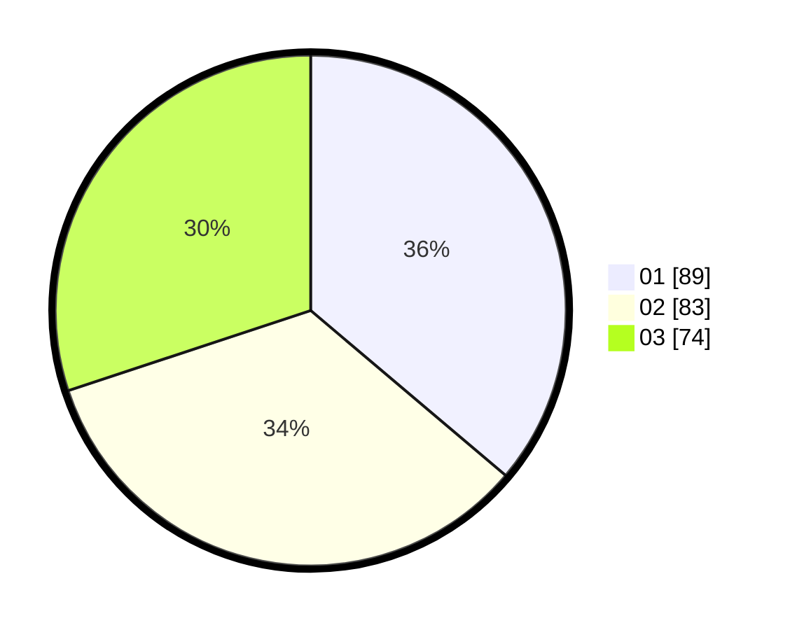

# Hasil

Hasil perolehan suara paslon dapat dilihat pada file paslon-01.txt, paslon-02.txt, dan paslon-03.txt.

Jika tidak ada, artinya data tersebut belum ada pada SIREKAP.

## Perolehan Suara

 * Paslon 01: **89**.
 * Paslon 02: **83**.
 * Paslon 03: **74**.

## Foto C Plano

https://sirekap-obj-formc.kpu.go.id/059f/pemilu/ppwp/31/71/02/10/04/3171021004057-20240214-195429--efce8987-965f-479c-9fac-5c74b2bdec0e.jpg

https://sirekap-obj-formc.kpu.go.id/059f/pemilu/ppwp/31/71/02/10/04/3171021004057-20240214-195535--e141e6ef-f4c2-4e81-b4c5-1553f61ea64f.jpg

https://sirekap-obj-formc.kpu.go.id/059f/pemilu/ppwp/31/71/02/10/04/3171021004057-20240214-195628--ec26c153-aadf-42ff-9dc8-4be23a162985.jpg
