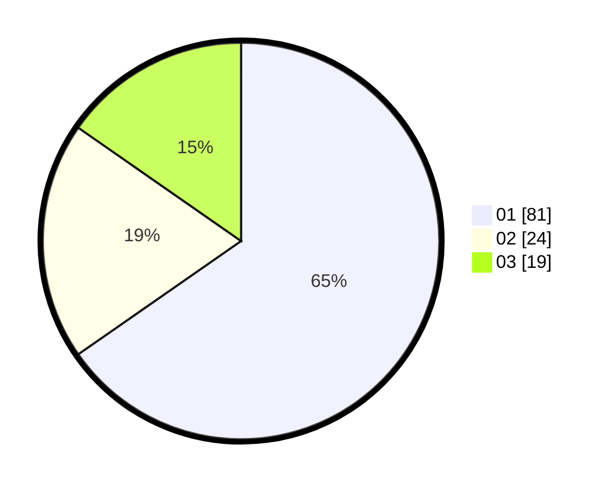

# Hasil

Hasil perolehan suara paslon dapat dilihat pada file paslon-01.txt, paslon-02.txt, dan paslon-03.txt.

Jika tidak ada, artinya data tersebut belum ada pada SIREKAP.

## Perolehan Suara

 * Paslon 01: **81**.
 * Paslon 02: **24**.
 * Paslon 03: **19**.

## Foto C Plano

https://sirekap-obj-formc.kpu.go.id/9b97/pemilu/ppwp/31/71/02/10/05/3171021005004-20240216-143658--2dd904a7-6cd9-4f9f-a3e8-3b685c8945f1.jpg

https://sirekap-obj-formc.kpu.go.id/9b97/pemilu/ppwp/31/71/02/10/05/3171021005004-20240216-143700--a742691a-91ff-4643-9cb2-0dfcecaf86b6.jpg

https://sirekap-obj-formc.kpu.go.id/9b97/pemilu/ppwp/31/71/02/10/05/3171021005004-20240216-143659--32b85321-f150-43c8-b420-b8a31ded445c.jpg

## DATA PEMILIH TETAP

Jumlah pemilih dalam DPT: **287**.
 * L: **146**.
 * P: **141**.

## DATA PENGGUNA HAK PILIH

Jumlah pengguna hak pilih dalam DPT: **201**.
 * L: **106**.
 * P: **95**.

Jumlah pengguna hak pilih dalam DPTb: **18**.
 * L: **3**.
 * P: **15**.

Jumlah pengguna hak pilih dalam DPK: **6**.
 * L: **2**.
 * P: **4**.

Jumlah pengguna hak pilih: **225**.
 * L: **111**.
 * P: **114**.

## JUMLAH SUARA SAH DAN TIDAK SAH

JUMLAH SELURUH SUARA SAH: **224**.

JUMLAH SUARA TIDAK SAH: **1**.

JUMLAH SELURUH SUARA SAH DAN SUARA TIDAK SAH: **225**.
