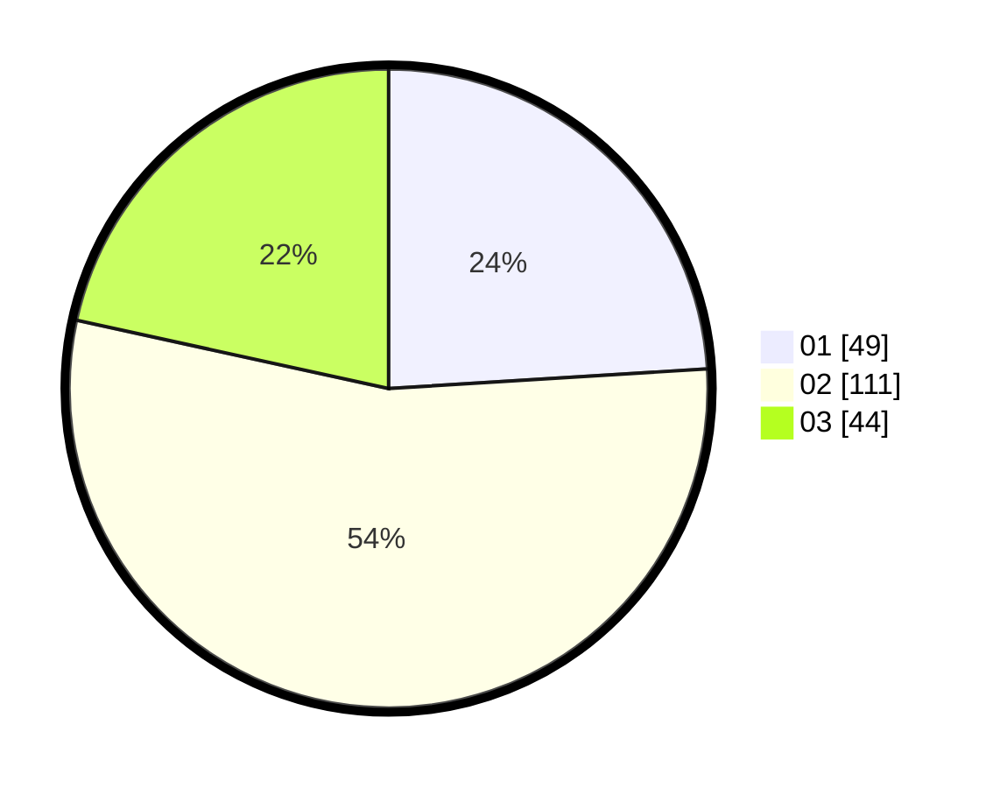

# Hasil

Hasil perolehan suara paslon dapat dilihat pada file paslon-01.txt, paslon-02.txt, dan paslon-03.txt.

Jika tidak ada, artinya data tersebut belum ada pada SIREKAP.

## Perolehan Suara

 * Paslon 01: **49**.
 * Paslon 02: **111**.
 * Paslon 03: **44**.

## Foto C Plano

https://sirekap-obj-formc.kpu.go.id/5edf/pemilu/ppwp/31/71/02/10/05/3171021005005-20240214-235004--fa9cfd4a-7c38-486e-ae92-a88e2e522dd7.jpg

https://sirekap-obj-formc.kpu.go.id/5edf/pemilu/ppwp/31/71/02/10/05/3171021005005-20240214-235208--b6a3424e-19ec-4459-a1c0-b3403fa03d3c.jpg

https://sirekap-obj-formc.kpu.go.id/5edf/pemilu/ppwp/31/71/02/10/05/3171021005005-20240214-235309--d147bbab-58b5-4351-bbba-9299b5968abf.jpg
