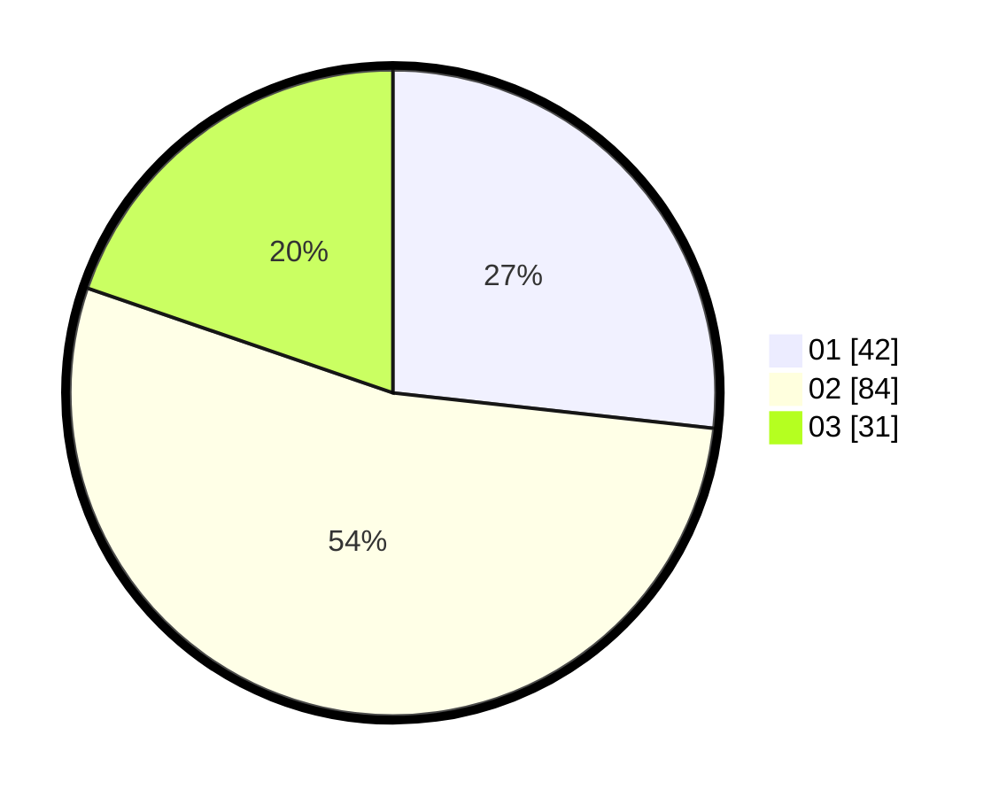

# Hasil

Hasil perolehan suara paslon dapat dilihat pada file paslon-01.txt, paslon-02.txt, dan paslon-03.txt.

Jika tidak ada, artinya data tersebut belum ada pada SIREKAP.

## Perolehan Suara

 * Paslon 01: **42**.
 * Paslon 02: **84**.
 * Paslon 03: **31**.

## Foto C Plano

https://sirekap-obj-formc.kpu.go.id/7f3d/pemilu/ppwp/31/71/02/10/05/3171021005013-20240214-213928--eac5f49a-4fb2-4aba-8f42-da10747b5568.jpg

https://sirekap-obj-formc.kpu.go.id/7f3d/pemilu/ppwp/31/71/02/10/05/3171021005013-20240214-214051--f71f6438-911d-420d-91f4-9e7e253ed109.jpg

https://sirekap-obj-formc.kpu.go.id/7f3d/pemilu/ppwp/31/71/02/10/05/3171021005013-20240214-214203--8435c175-bda4-42fd-b005-7412210c7c61.jpg
