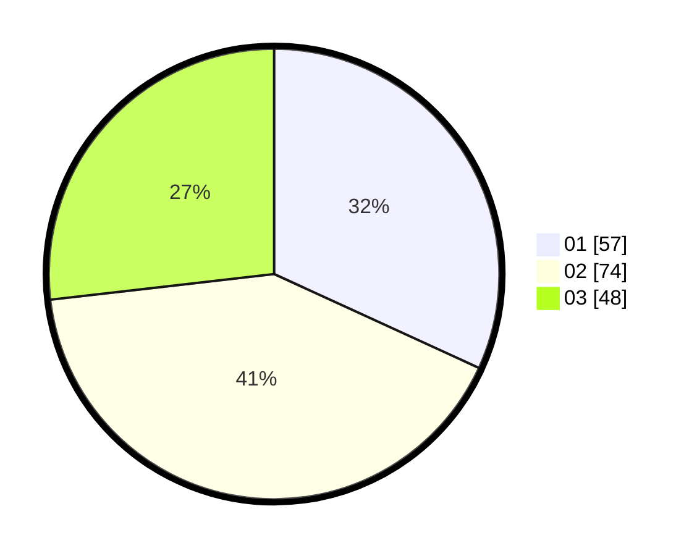

# Hasil

Hasil perolehan suara paslon dapat dilihat pada file paslon-01.txt, paslon-02.txt, dan paslon-03.txt.

Jika tidak ada, artinya data tersebut belum ada pada SIREKAP.

## Perolehan Suara

 * Paslon 01: **57**.
 * Paslon 02: **74**.
 * Paslon 03: **48**.

## Foto C Plano

https://sirekap-obj-formc.kpu.go.id/0caf/pemilu/ppwp/31/71/02/10/05/3171021005016-20240214-194034--a4bc92e0-a281-40cd-b25e-8897d907990c.jpg

https://sirekap-obj-formc.kpu.go.id/0caf/pemilu/ppwp/31/71/02/10/05/3171021005016-20240214-194043--f1282438-eb75-4c78-a04d-93a0f3807db3.jpg

https://sirekap-obj-formc.kpu.go.id/0caf/pemilu/ppwp/31/71/02/10/05/3171021005016-20240214-194050--1ffd1308-3cc3-4b40-9df5-4b41431ff6d0.jpg

## DATA PEMILIH TETAP

Jumlah pemilih dalam DPT: **276**.
 * L: **142**.
 * P: **134**.

## DATA PENGGUNA HAK PILIH

Jumlah pengguna hak pilih dalam DPT: **177**.
 * L: **92**.
 * P: **85**.

Jumlah pengguna hak pilih dalam DPTb: **0**.
 * L: **0**.
 * P: **0**.

Jumlah pengguna hak pilih dalam DPK: **3**.
 * L: **1**.
 * P: **2**.

Jumlah pengguna hak pilih: **180**.
 * L: **93**.
 * P: **87**.

## JUMLAH SUARA SAH DAN TIDAK SAH

JUMLAH SELURUH SUARA SAH: **0**.

JUMLAH SUARA TIDAK SAH: **0**.

JUMLAH SELURUH SUARA SAH DAN SUARA TIDAK SAH: **0**.
