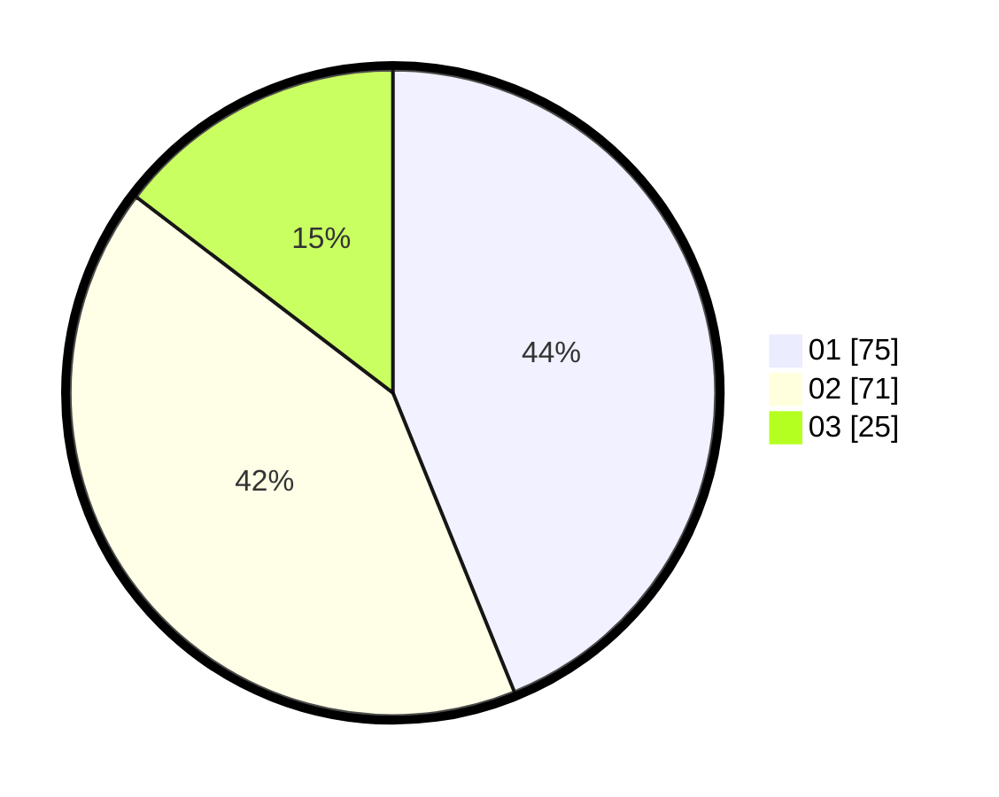

# Hasil

Hasil perolehan suara paslon dapat dilihat pada file paslon-01.txt, paslon-02.txt, dan paslon-03.txt.

Jika tidak ada, artinya data tersebut belum ada pada SIREKAP.

## Perolehan Suara

 * Paslon 01: **75**.
 * Paslon 02: **71**.
 * Paslon 03: **25**.

## Foto C Plano

https://sirekap-obj-formc.kpu.go.id/147f/pemilu/ppwp/31/71/02/10/05/3171021005025-20240216-211742--eca5faa7-01da-4747-802c-32a96eb47633.jpg

https://sirekap-obj-formc.kpu.go.id/147f/pemilu/ppwp/31/71/02/10/05/3171021005025-20240216-211743--5038afff-9679-4c6b-9a19-9acd8328e154.jpg

https://sirekap-obj-formc.kpu.go.id/147f/pemilu/ppwp/31/71/02/10/05/3171021005025-20240216-211742--2a019741-a19d-4d72-bd34-38bff8b569f5.jpg

## DATA PEMILIH TETAP

Jumlah pemilih dalam DPT: **276**.
 * L: **138**.
 * P: **138**.

## DATA PENGGUNA HAK PILIH

Jumlah pengguna hak pilih dalam DPT: **171**.
 * L: **81**.
 * P: **90**.

Jumlah pengguna hak pilih dalam DPTb: **0**.
 * L: **0**.
 * P: **0**.

Jumlah pengguna hak pilih dalam DPK: **0**.
 * L: **0**.
 * P: **0**.

Jumlah pengguna hak pilih: **171**.
 * L: **81**.
 * P: **90**.

## JUMLAH SUARA SAH DAN TIDAK SAH

JUMLAH SELURUH SUARA SAH: **171**.

JUMLAH SUARA TIDAK SAH: **1**.

JUMLAH SELURUH SUARA SAH DAN SUARA TIDAK SAH: **172**.
