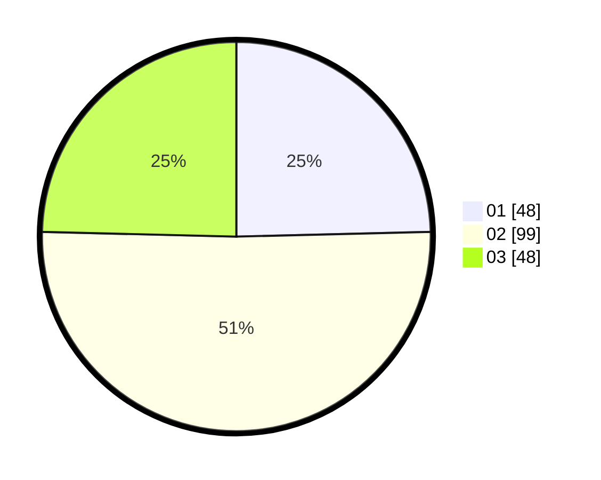

# Hasil

Hasil perolehan suara paslon dapat dilihat pada file paslon-01.txt, paslon-02.txt, dan paslon-03.txt.

Jika tidak ada, artinya data tersebut belum ada pada SIREKAP.

## Perolehan Suara

 * Paslon 01: **48**.
 * Paslon 02: **99**.
 * Paslon 03: **48**.

## Foto C Plano

https://sirekap-obj-formc.kpu.go.id/b3a9/pemilu/ppwp/31/71/02/10/05/3171021005027-20240215-005242--fa3e2276-c642-4dec-82fe-baa6afa8e381.jpg

https://sirekap-obj-formc.kpu.go.id/b3a9/pemilu/ppwp/31/71/02/10/05/3171021005027-20240215-005332--ac18d1e0-6630-4d99-8f8b-2a0e720965c0.jpg

https://sirekap-obj-formc.kpu.go.id/b3a9/pemilu/ppwp/31/71/02/10/05/3171021005027-20240215-005357--32c42317-9d6f-4426-ba80-7f9f2d55c940.jpg
