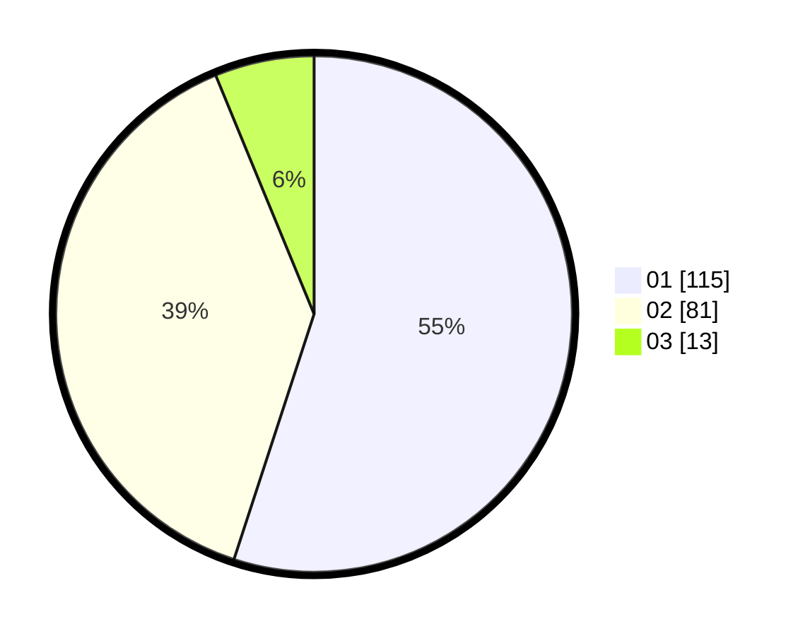

# Hasil

Hasil perolehan suara paslon dapat dilihat pada file paslon-01.txt, paslon-02.txt, dan paslon-03.txt.

Jika tidak ada, artinya data tersebut belum ada pada SIREKAP.

## Perolehan Suara

 * Paslon 01: **115**.
 * Paslon 02: **81**.
 * Paslon 03: **13**.

## Foto C Plano

https://sirekap-obj-formc.kpu.go.id/cdf3/pemilu/ppwp/31/71/02/10/05/3171021005036-20240215-011313--99bdf753-7b75-48c3-b351-cdbbdaa178a7.jpg

https://sirekap-obj-formc.kpu.go.id/cdf3/pemilu/ppwp/31/71/02/10/05/3171021005036-20240215-011518--f7c183bd-9bc4-41fa-a7f9-a18243bd69d2.jpg
