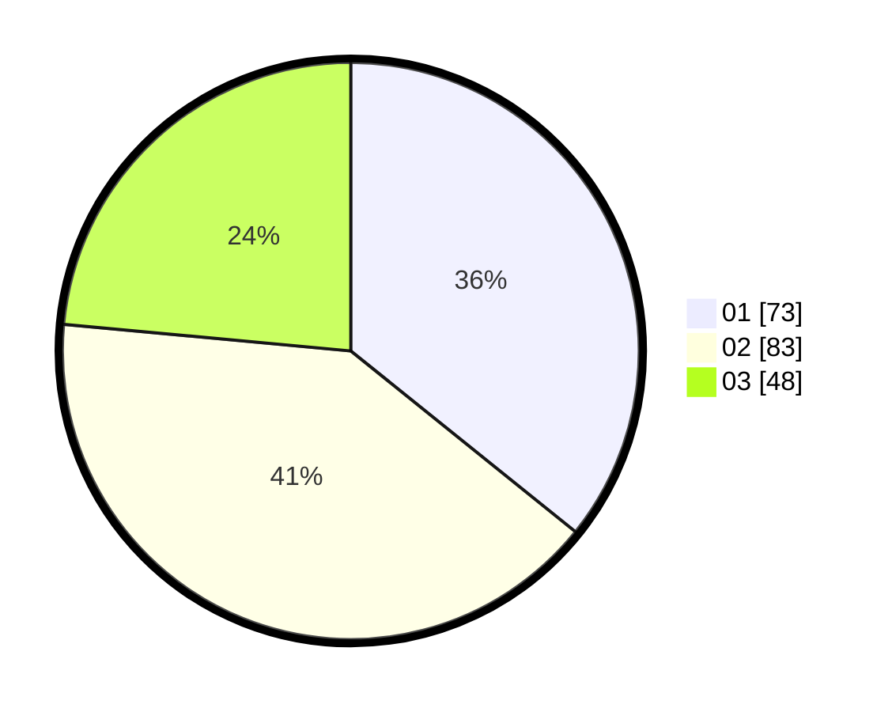

# Hasil

Hasil perolehan suara paslon dapat dilihat pada file paslon-01.txt, paslon-02.txt, dan paslon-03.txt.

Jika tidak ada, artinya data tersebut belum ada pada SIREKAP.

## Perolehan Suara

 * Paslon 01: **73**.
 * Paslon 02: **83**.
 * Paslon 03: **48**.

## Foto C Plano

https://sirekap-obj-formc.kpu.go.id/e894/pemilu/ppwp/31/71/02/10/05/3171021005039-20240215-211323--b28149f6-488c-4590-92e0-6065aab2db6d.jpg

https://sirekap-obj-formc.kpu.go.id/e894/pemilu/ppwp/31/71/02/10/05/3171021005039-20240217-212033--387196bd-3f33-469a-9bfe-613d454027ba.jpg

https://sirekap-obj-formc.kpu.go.id/e894/pemilu/ppwp/31/71/02/10/05/3171021005039-20240217-212332--4b8c9094-5b59-431d-b376-b3b5a40bf603.jpg
