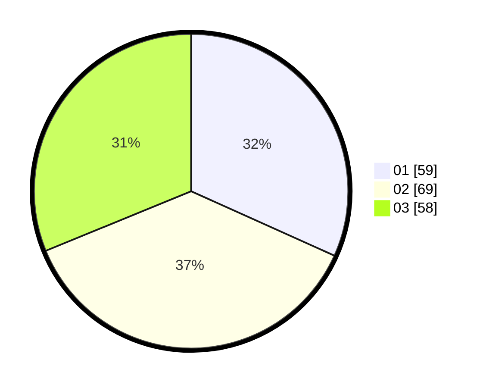

# Hasil

Hasil perolehan suara paslon dapat dilihat pada file paslon-01.txt, paslon-02.txt, dan paslon-03.txt.

Jika tidak ada, artinya data tersebut belum ada pada SIREKAP.

## Perolehan Suara

 * Paslon 01: **59**.
 * Paslon 02: **69**.
 * Paslon 03: **58**.

## Foto C Plano

https://sirekap-obj-formc.kpu.go.id/1b16/pemilu/ppwp/31/71/02/10/05/3171021005041-20240217-223454--70aefee5-468f-4238-9f4b-ac24fb0502e9.jpg

https://sirekap-obj-formc.kpu.go.id/1b16/pemilu/ppwp/31/71/02/10/05/3171021005041-20240217-225157--c8768a09-812f-41fa-ab10-43884d9347f2.jpg

https://sirekap-obj-formc.kpu.go.id/1b16/pemilu/ppwp/31/71/02/10/05/3171021005041-20240217-223824--5574bc84-9b09-45b6-887c-aa0b627d8c9b.jpg
