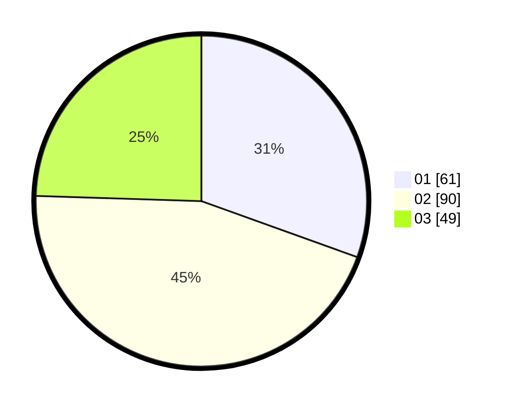

# Hasil

Hasil perolehan suara paslon dapat dilihat pada file paslon-01.txt, paslon-02.txt, dan paslon-03.txt.

Jika tidak ada, artinya data tersebut belum ada pada SIREKAP.

## Perolehan Suara

 * Paslon 01: **61**.
 * Paslon 02: **90**.
 * Paslon 03: **49**.

## Foto C Plano

https://sirekap-obj-formc.kpu.go.id/80b0/pemilu/ppwp/31/71/02/10/05/3171021005042-20240215-025554--7db780c9-e4bd-4d04-bf85-4e10d52df59e.jpg

https://sirekap-obj-formc.kpu.go.id/80b0/pemilu/ppwp/31/71/02/10/05/3171021005042-20240215-025607--a1f6aeb5-9f62-45c6-9f50-057bfadae80a.jpg

https://sirekap-obj-formc.kpu.go.id/80b0/pemilu/ppwp/31/71/02/10/05/3171021005042-20240215-025613--8148830f-45b2-42a9-ae3c-5d85beb0c21c.jpg

## DATA PEMILIH TETAP

Jumlah pemilih dalam DPT: **269**.
 * L: **135**.
 * P: **134**.

## DATA PENGGUNA HAK PILIH

Jumlah pengguna hak pilih dalam DPT: **199**.
 * L: **101**.
 * P: **98**.

Jumlah pengguna hak pilih dalam DPTb: **2**.
 * L: **1**.
 * P: **1**.

Jumlah pengguna hak pilih dalam DPK: **1**.
 * L: **0**.
 * P: **1**.

Jumlah pengguna hak pilih: **202**.
 * L: **102**.
 * P: **100**.

## JUMLAH SUARA SAH DAN TIDAK SAH

JUMLAH SELURUH SUARA SAH: **0**.

JUMLAH SUARA TIDAK SAH: **0**.

JUMLAH SELURUH SUARA SAH DAN SUARA TIDAK SAH: **0**.
