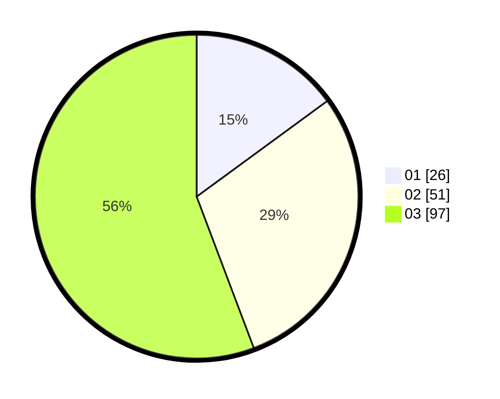

# Hasil

Hasil perolehan suara paslon dapat dilihat pada file paslon-01.txt, paslon-02.txt, dan paslon-03.txt.

Jika tidak ada, artinya data tersebut belum ada pada SIREKAP.

## Perolehan Suara

 * Paslon 01: **26**.
 * Paslon 02: **51**.
 * Paslon 03: **97**.

## Foto C Plano

https://sirekap-obj-formc.kpu.go.id/3cfd/pemilu/ppwp/31/71/02/10/05/3171021005048-20240214-225011--b5d788ec-0162-4c30-90ac-1e4f760f10c3.jpg

https://sirekap-obj-formc.kpu.go.id/3cfd/pemilu/ppwp/31/71/02/10/05/3171021005048-20240214-225122--d98957cf-4eaa-4fe5-8db0-e56c0a5c97c2.jpg

https://sirekap-obj-formc.kpu.go.id/3cfd/pemilu/ppwp/31/71/02/10/05/3171021005048-20240214-225159--b3479ba0-b4c4-4d5e-8457-a3c097df8d27.jpg
