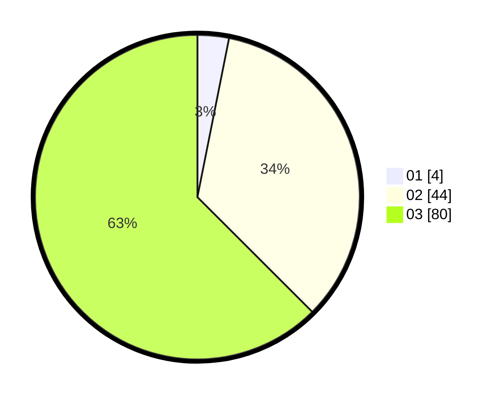

# Hasil

Hasil perolehan suara paslon dapat dilihat pada file paslon-01.txt, paslon-02.txt, dan paslon-03.txt.

Jika tidak ada, artinya data tersebut belum ada pada SIREKAP.

## Perolehan Suara

 * Paslon 01: **4**.
 * Paslon 02: **44**.
 * Paslon 03: **80**.

## Foto C Plano

https://sirekap-obj-formc.kpu.go.id/d663/pemilu/ppwp/31/71/02/10/05/3171021005064-20240215-202712--ecf3c0ef-36fc-44ea-bba9-9197f17f228c.jpg

https://sirekap-obj-formc.kpu.go.id/d663/pemilu/ppwp/31/71/02/10/05/3171021005064-20240215-202715--1ee0f128-f17b-4f95-b7b4-7d87aceacfce.jpg

https://sirekap-obj-formc.kpu.go.id/d663/pemilu/ppwp/31/71/02/10/05/3171021005064-20240215-202713--8743555f-2bbf-48bd-8361-9158d2edf627.jpg

## DATA PEMILIH TETAP

Jumlah pemilih dalam DPT: **202**.
 * L: **96**.
 * P: **106**.

## DATA PENGGUNA HAK PILIH

Jumlah pengguna hak pilih dalam DPT: **124**.
 * L: **60**.
 * P: **64**.

Jumlah pengguna hak pilih dalam DPTb: **4**.
 * L: **4**.
 * P: **0**.

Jumlah pengguna hak pilih dalam DPK: **4**.
 * L: **2**.
 * P: **2**.

Jumlah pengguna hak pilih: **132**.
 * L: **66**.
 * P: **66**.

## JUMLAH SUARA SAH DAN TIDAK SAH

JUMLAH SELURUH SUARA SAH: **128**.

JUMLAH SUARA TIDAK SAH: **4**.

JUMLAH SELURUH SUARA SAH DAN SUARA TIDAK SAH: **132**.
