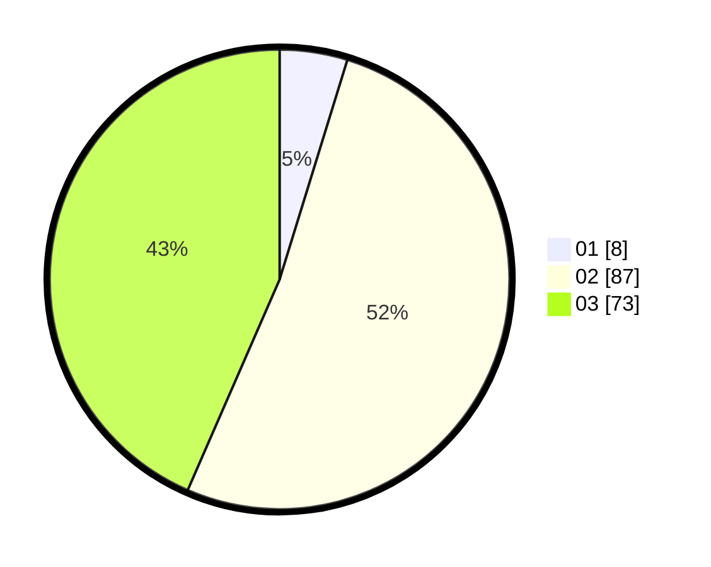

# Hasil

Hasil perolehan suara paslon dapat dilihat pada file paslon-01.txt, paslon-02.txt, dan paslon-03.txt.

Jika tidak ada, artinya data tersebut belum ada pada SIREKAP.

## Perolehan Suara

 * Paslon 01: **8**.
 * Paslon 02: **87**.
 * Paslon 03: **73**.

## Foto C Plano

https://sirekap-obj-formc.kpu.go.id/3c57/pemilu/ppwp/31/71/02/10/05/3171021005065-20240215-225127--66afd8ac-e169-42e5-9101-b6e60e6dae9f.jpg

https://sirekap-obj-formc.kpu.go.id/3c57/pemilu/ppwp/31/71/02/10/05/3171021005065-20240215-225129--ab0b0dd6-2291-466d-a44b-40d5a7a522aa.jpg

https://sirekap-obj-formc.kpu.go.id/3c57/pemilu/ppwp/31/71/02/10/05/3171021005065-20240215-225128--6d79de9b-3b98-4cc2-82e1-950ab0d6361e.jpg

## DATA PEMILIH TETAP

Jumlah pemilih dalam DPT: **267**.
 * L: **134**.
 * P: **133**.

## DATA PENGGUNA HAK PILIH

Jumlah pengguna hak pilih dalam DPT: **164**.
 * L: **79**.
 * P: **85**.

Jumlah pengguna hak pilih dalam DPTb: **2**.
 * L: **0**.
 * P: **2**.

Jumlah pengguna hak pilih dalam DPK: **4**.
 * L: **3**.
 * P: **1**.

Jumlah pengguna hak pilih: **170**.
 * L: **82**.
 * P: **88**.

## JUMLAH SUARA SAH DAN TIDAK SAH

JUMLAH SELURUH SUARA SAH: **168**.

JUMLAH SUARA TIDAK SAH: **2**.

JUMLAH SELURUH SUARA SAH DAN SUARA TIDAK SAH: **170**.
