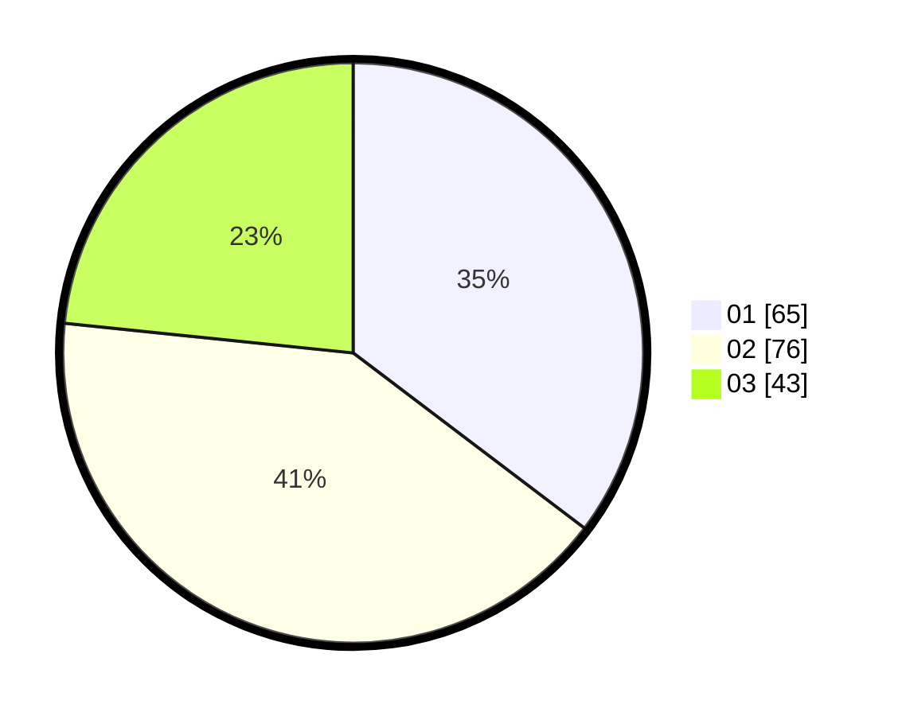

# Hasil

Hasil perolehan suara paslon dapat dilihat pada file paslon-01.txt, paslon-02.txt, dan paslon-03.txt.

Jika tidak ada, artinya data tersebut belum ada pada SIREKAP.

## Perolehan Suara

 * Paslon 01: **65**.
 * Paslon 02: **76**.
 * Paslon 03: **43**.

## Foto C Plano

https://sirekap-obj-formc.kpu.go.id/ce8a/pemilu/ppwp/31/71/02/10/05/3171021005072-20240216-060935--142d0090-534b-4377-abc9-7f48c461523e.jpg

https://sirekap-obj-formc.kpu.go.id/ce8a/pemilu/ppwp/31/71/02/10/05/3171021005072-20240216-060936--da140926-8b5f-4175-b8f2-fa6fc5fc5fb0.jpg

https://sirekap-obj-formc.kpu.go.id/ce8a/pemilu/ppwp/31/71/02/10/05/3171021005072-20240216-060935--c12b9eab-731f-471c-8492-a224326f915c.jpg

## DATA PEMILIH TETAP

Jumlah pemilih dalam DPT: **244**.
 * L: **117**.
 * P: **127**.

## DATA PENGGUNA HAK PILIH

Jumlah pengguna hak pilih dalam DPT: **180**.
 * L: **88**.
 * P: **92**.

Jumlah pengguna hak pilih dalam DPTb: **0**.
 * L: **0**.
 * P: **0**.

Jumlah pengguna hak pilih dalam DPK: **5**.
 * L: **2**.
 * P: **3**.

Jumlah pengguna hak pilih: **185**.
 * L: **90**.
 * P: **95**.

## JUMLAH SUARA SAH DAN TIDAK SAH

JUMLAH SELURUH SUARA SAH: **184**.

JUMLAH SUARA TIDAK SAH: **1**.

JUMLAH SELURUH SUARA SAH DAN SUARA TIDAK SAH: **185**.
