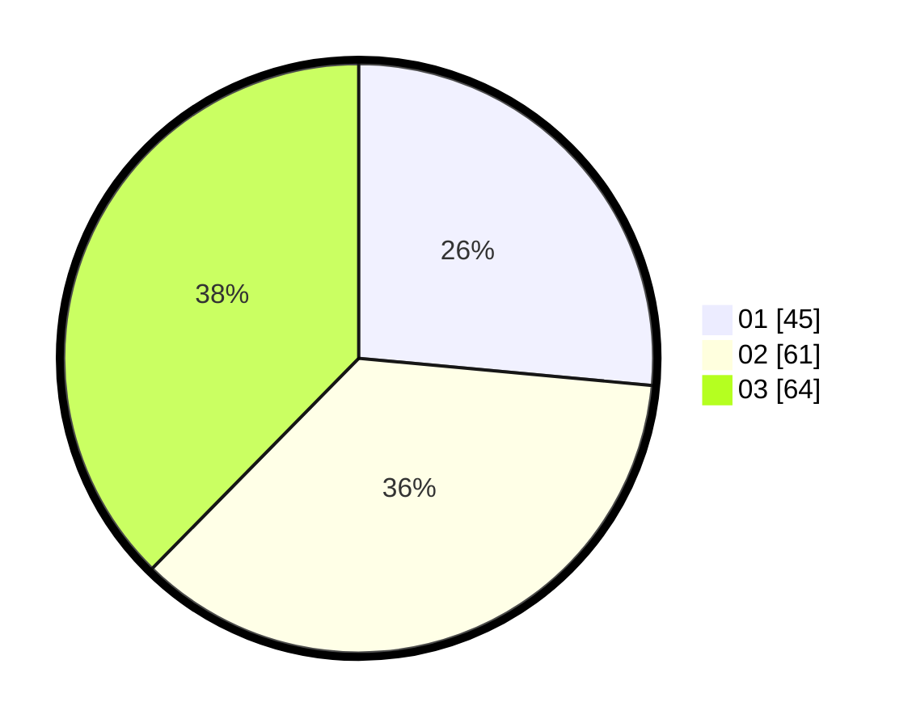

# Hasil

Hasil perolehan suara paslon dapat dilihat pada file paslon-01.txt, paslon-02.txt, dan paslon-03.txt.

Jika tidak ada, artinya data tersebut belum ada pada SIREKAP.

## Perolehan Suara

 * Paslon 01: **45**.
 * Paslon 02: **61**.
 * Paslon 03: **64**.

## Foto C Plano

https://sirekap-obj-formc.kpu.go.id/6d2b/pemilu/ppwp/31/71/02/10/05/3171021005078-20240215-191215--2fe79b60-7e30-4646-86fb-9571487b3f88.jpg

https://sirekap-obj-formc.kpu.go.id/6d2b/pemilu/ppwp/31/71/02/10/05/3171021005078-20240215-191303--45018c15-cdf0-4c4b-aa86-78a7647b2dea.jpg

https://sirekap-obj-formc.kpu.go.id/6d2b/pemilu/ppwp/31/71/02/10/05/3171021005078-20240215-183735--c99a7287-a7e7-47d0-a504-9e0cf536908f.jpg

## DATA PEMILIH TETAP

Jumlah pemilih dalam DPT: **240**.
 * L: **126**.
 * P: **114**.

## DATA PENGGUNA HAK PILIH

Jumlah pengguna hak pilih dalam DPT: **166**.
 * L: **81**.
 * P: **85**.

Jumlah pengguna hak pilih dalam DPTb: **5**.
 * L: **1**.
 * P: **4**.

Jumlah pengguna hak pilih dalam DPK: **2**.
 * L: **1**.
 * P: **1**.

Jumlah pengguna hak pilih: **173**.
 * L: **83**.
 * P: **90**.

## JUMLAH SUARA SAH DAN TIDAK SAH

JUMLAH SELURUH SUARA SAH: **170**.

JUMLAH SUARA TIDAK SAH: **3**.

JUMLAH SELURUH SUARA SAH DAN SUARA TIDAK SAH: **173**.
