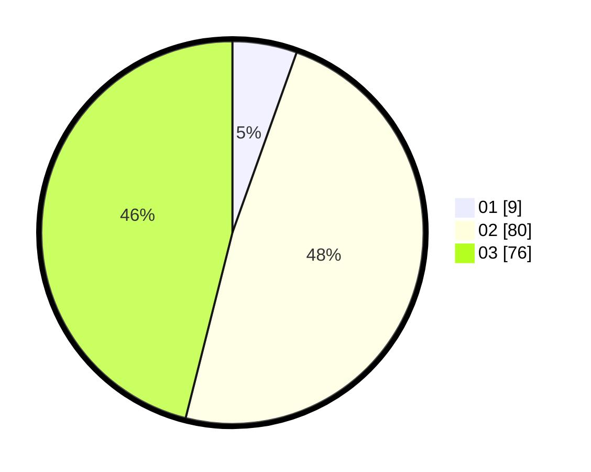

# Hasil

Hasil perolehan suara paslon dapat dilihat pada file paslon-01.txt, paslon-02.txt, dan paslon-03.txt.

Jika tidak ada, artinya data tersebut belum ada pada SIREKAP.

## Perolehan Suara

 * Paslon 01: **9**.
 * Paslon 02: **80**.
 * Paslon 03: **76**.

## Foto C Plano

https://sirekap-obj-formc.kpu.go.id/bcb7/pemilu/ppwp/31/71/02/10/05/3171021005088-20240214-192432--a5019d9a-1c98-4494-9731-8a590f970867.jpg

https://sirekap-obj-formc.kpu.go.id/bcb7/pemilu/ppwp/31/71/02/10/05/3171021005088-20240214-194431--5f4a9b37-cf53-4857-a577-e4c5004d8517.jpg

https://sirekap-obj-formc.kpu.go.id/bcb7/pemilu/ppwp/31/71/02/10/05/3171021005088-20240214-192548--9ca25e04-8efe-4115-92ef-2b3989915a9f.jpg

## DATA PEMILIH TETAP

Jumlah pemilih dalam DPT: **255**.
 * L: **127**.
 * P: **128**.

## DATA PENGGUNA HAK PILIH

Jumlah pengguna hak pilih dalam DPT: **159**.
 * L: **85**.
 * P: **74**.

Jumlah pengguna hak pilih dalam DPTb: **6**.
 * L: **5**.
 * P: **1**.

Jumlah pengguna hak pilih dalam DPK: **0**.
 * L: **0**.
 * P: **0**.

Jumlah pengguna hak pilih: **165**.
 * L: **90**.
 * P: **75**.

## JUMLAH SUARA SAH DAN TIDAK SAH

JUMLAH SELURUH SUARA SAH: **165**.

JUMLAH SUARA TIDAK SAH: **0**.

JUMLAH SELURUH SUARA SAH DAN SUARA TIDAK SAH: **165**.
