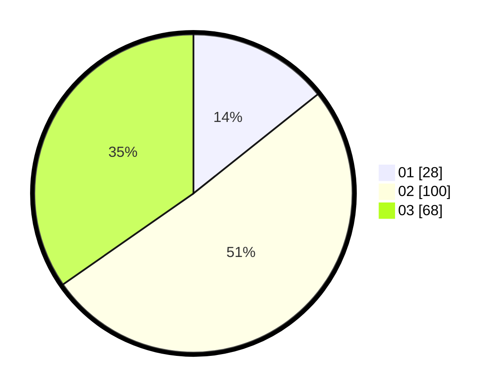

# Hasil

Hasil perolehan suara paslon dapat dilihat pada file paslon-01.txt, paslon-02.txt, dan paslon-03.txt.

Jika tidak ada, artinya data tersebut belum ada pada SIREKAP.

## Perolehan Suara

 * Paslon 01: **28**.
 * Paslon 02: **100**.
 * Paslon 03: **68**.

## Foto C Plano

https://sirekap-obj-formc.kpu.go.id/7f5d/pemilu/ppwp/31/71/03/10/01/3171031001002-20240214-210412--26b4a306-5780-47c8-96cc-d66a2d01a3a0.jpg

https://sirekap-obj-formc.kpu.go.id/7f5d/pemilu/ppwp/31/71/03/10/01/3171031001002-20240214-210502--7683eb9d-2f85-4f27-8ca5-4f058db4ae51.jpg

https://sirekap-obj-formc.kpu.go.id/7f5d/pemilu/ppwp/31/71/03/10/01/3171031001002-20240214-210641--7c2b817c-dbc9-4a9e-9139-e4d48ad3b7e2.jpg

## DATA PEMILIH TETAP

Jumlah pemilih dalam DPT: **188**.
 * L: **86**.
 * P: **102**.

## DATA PENGGUNA HAK PILIH

Jumlah pengguna hak pilih dalam DPT: **188**.
 * L: **0**.
 * P: **0**.

Jumlah pengguna hak pilih dalam DPTb: **1**.
 * L: **0**.
 * P: **0**.

Jumlah pengguna hak pilih dalam DPK: **9**.
 * L: **0**.
 * P: **0**.

Jumlah pengguna hak pilih: **198**.
 * L: **0**.
 * P: **0**.

## JUMLAH SUARA SAH DAN TIDAK SAH

JUMLAH SELURUH SUARA SAH: **196**.

JUMLAH SUARA TIDAK SAH: **2**.

JUMLAH SELURUH SUARA SAH DAN SUARA TIDAK SAH: **198**.
