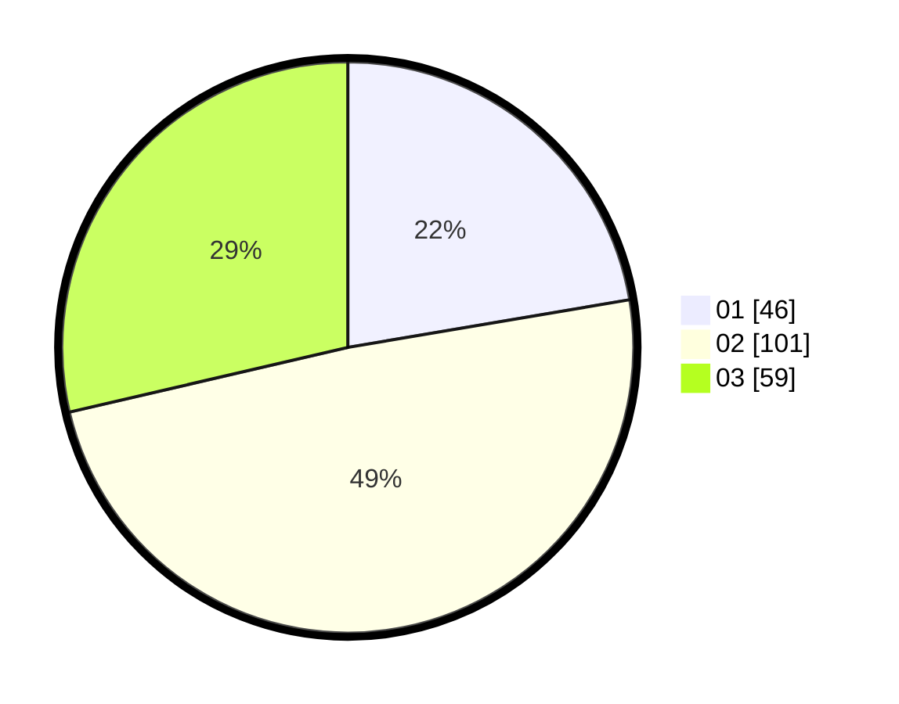

# Hasil

Hasil perolehan suara paslon dapat dilihat pada file paslon-01.txt, paslon-02.txt, dan paslon-03.txt.

Jika tidak ada, artinya data tersebut belum ada pada SIREKAP.

## Perolehan Suara

 * Paslon 01: **46**.
 * Paslon 02: **101**.
 * Paslon 03: **59**.

## Foto C Plano

https://sirekap-obj-formc.kpu.go.id/1675/pemilu/ppwp/31/71/03/10/01/3171031001003-20240214-230739--0f7d73b2-1c8e-42ce-8113-213b96993e28.jpg

https://sirekap-obj-formc.kpu.go.id/1675/pemilu/ppwp/31/71/03/10/01/3171031001003-20240214-213238--f2fbe1ae-ea6e-42bf-93a4-768c0d499ef5.jpg

https://sirekap-obj-formc.kpu.go.id/1675/pemilu/ppwp/31/71/03/10/01/3171031001003-20240214-230910--7d5ff0fb-596c-44d1-a1e0-3c0ebe38dfef.jpg

## DATA PEMILIH TETAP

Jumlah pemilih dalam DPT: **254**.
 * L: **114**.
 * P: **140**.

## DATA PENGGUNA HAK PILIH

Jumlah pengguna hak pilih dalam DPT: **200**.
 * L: **88**.
 * P: **112**.

Jumlah pengguna hak pilih dalam DPTb: **10**.
 * L: **4**.
 * P: **6**.

Jumlah pengguna hak pilih dalam DPK: **0**.
 * L: **0**.
 * P: **0**.

Jumlah pengguna hak pilih: **210**.
 * L: **92**.
 * P: **118**.

## JUMLAH SUARA SAH DAN TIDAK SAH

JUMLAH SELURUH SUARA SAH: **206**.

JUMLAH SUARA TIDAK SAH: **4**.

JUMLAH SELURUH SUARA SAH DAN SUARA TIDAK SAH: **210**.
