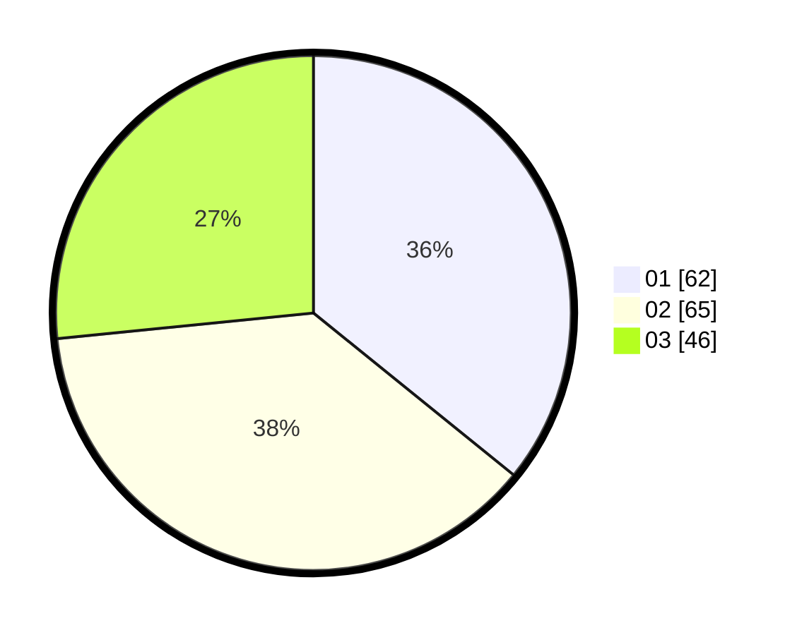

# Hasil

Hasil perolehan suara paslon dapat dilihat pada file paslon-01.txt, paslon-02.txt, dan paslon-03.txt.

Jika tidak ada, artinya data tersebut belum ada pada SIREKAP.

## Perolehan Suara

 * Paslon 01: **62**.
 * Paslon 02: **65**.
 * Paslon 03: **46**.

## Foto C Plano

https://sirekap-obj-formc.kpu.go.id/c7e1/pemilu/ppwp/31/71/03/10/01/3171031001005-20240215-214820--e1469801-c4cd-4c71-8f35-26560687d756.jpg

https://sirekap-obj-formc.kpu.go.id/c7e1/pemilu/ppwp/31/71/03/10/01/3171031001005-20240215-214820--2fa78070-30cf-4afc-b00b-6e2032422706.jpg

https://sirekap-obj-formc.kpu.go.id/c7e1/pemilu/ppwp/31/71/03/10/01/3171031001005-20240214-155339--6cb059c3-7ee6-4278-beae-634eacc58660.jpg

## DATA PEMILIH TETAP

Jumlah pemilih dalam DPT: **239**.
 * L: **114**.
 * P: **125**.

## DATA PENGGUNA HAK PILIH

Jumlah pengguna hak pilih dalam DPT: **169**.
 * L: **80**.
 * P: **89**.

Jumlah pengguna hak pilih dalam DPTb: **6**.
 * L: **2**.
 * P: **4**.

Jumlah pengguna hak pilih dalam DPK: **0**.
 * L: **0**.
 * P: **0**.

Jumlah pengguna hak pilih: **175**.
 * L: **82**.
 * P: **93**.

## JUMLAH SUARA SAH DAN TIDAK SAH

JUMLAH SELURUH SUARA SAH: **173**.

JUMLAH SUARA TIDAK SAH: **2**.

JUMLAH SELURUH SUARA SAH DAN SUARA TIDAK SAH: **175**.
