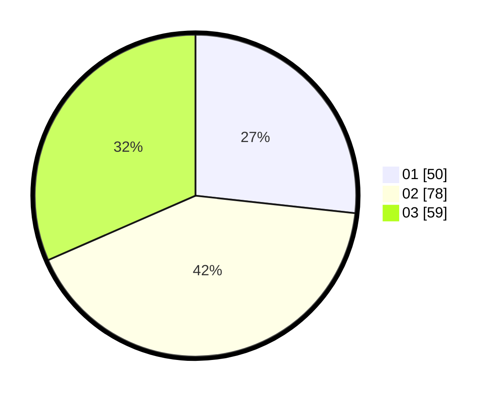

# Hasil

Hasil perolehan suara paslon dapat dilihat pada file paslon-01.txt, paslon-02.txt, dan paslon-03.txt.

Jika tidak ada, artinya data tersebut belum ada pada SIREKAP.

## Perolehan Suara

 * Paslon 01: **50**.
 * Paslon 02: **78**.
 * Paslon 03: **59**.

## Foto C Plano

https://sirekap-obj-formc.kpu.go.id/9e84/pemilu/ppwp/31/71/03/10/01/3171031001007-20240217-094351--3582df37-5d02-4c84-ab2c-608850451f19.jpg

https://sirekap-obj-formc.kpu.go.id/9e84/pemilu/ppwp/31/71/03/10/01/3171031001007-20240217-094353--27df66f1-3ced-48eb-a5e2-a743c30c6a9a.jpg

https://sirekap-obj-formc.kpu.go.id/9e84/pemilu/ppwp/31/71/03/10/01/3171031001007-20240217-094352--9ba73e50-a8f6-4c61-a92c-3c8b43a71c55.jpg

## DATA PEMILIH TETAP

Jumlah pemilih dalam DPT: **240**.
 * L: **123**.
 * P: **117**.

## DATA PENGGUNA HAK PILIH

Jumlah pengguna hak pilih dalam DPT: **185**.
 * L: **93**.
 * P: **92**.

Jumlah pengguna hak pilih dalam DPTb: **6**.
 * L: **2**.
 * P: **4**.

Jumlah pengguna hak pilih dalam DPK: **0**.
 * L: **0**.
 * P: **0**.

Jumlah pengguna hak pilih: **191**.
 * L: **95**.
 * P: **96**.

## JUMLAH SUARA SAH DAN TIDAK SAH

JUMLAH SELURUH SUARA SAH: **187**.

JUMLAH SUARA TIDAK SAH: **4**.

JUMLAH SELURUH SUARA SAH DAN SUARA TIDAK SAH: **191**.
