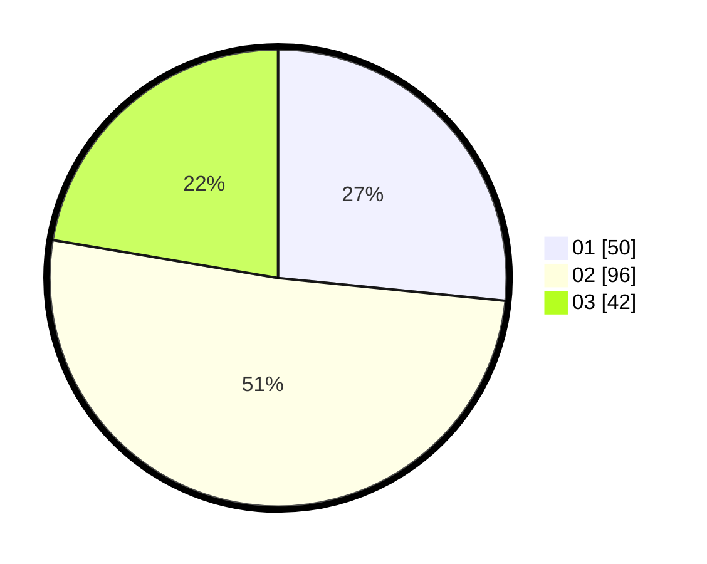

# Hasil

Hasil perolehan suara paslon dapat dilihat pada file paslon-01.txt, paslon-02.txt, dan paslon-03.txt.

Jika tidak ada, artinya data tersebut belum ada pada SIREKAP.

## Perolehan Suara

 * Paslon 01: **50**.
 * Paslon 02: **96**.
 * Paslon 03: **42**.

## Foto C Plano

https://sirekap-obj-formc.kpu.go.id/8574/pemilu/ppwp/31/71/03/10/01/3171031001012-20240214-202210--e45f59f2-8a8e-4e90-a1b5-b42a195ef142.jpg

https://sirekap-obj-formc.kpu.go.id/8574/pemilu/ppwp/31/71/03/10/01/3171031001012-20240214-194825--3646d777-e565-46c9-abf6-3a1c9e6a8f67.jpg

https://sirekap-obj-formc.kpu.go.id/8574/pemilu/ppwp/31/71/03/10/01/3171031001012-20240214-210028--25530df9-dbfa-455a-a966-5c1b2b126849.jpg

## DATA PEMILIH TETAP

Jumlah pemilih dalam DPT: **262**.
 * L: **131**.
 * P: **131**.

## DATA PENGGUNA HAK PILIH

Jumlah pengguna hak pilih dalam DPT: **182**.
 * L: **87**.
 * P: **95**.

Jumlah pengguna hak pilih dalam DPTb: **1**.
 * L: **1**.
 * P: **0**.

Jumlah pengguna hak pilih dalam DPK: **3**.
 * L: **1**.
 * P: **2**.

Jumlah pengguna hak pilih: **186**.
 * L: **89**.
 * P: **97**.

## JUMLAH SUARA SAH DAN TIDAK SAH

JUMLAH SELURUH SUARA SAH: **188**.

JUMLAH SUARA TIDAK SAH: **2**.

JUMLAH SELURUH SUARA SAH DAN SUARA TIDAK SAH: **190**.
