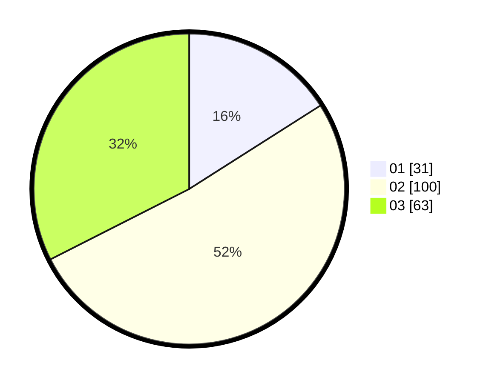

# Hasil

Hasil perolehan suara paslon dapat dilihat pada file paslon-01.txt, paslon-02.txt, dan paslon-03.txt.

Jika tidak ada, artinya data tersebut belum ada pada SIREKAP.

## Perolehan Suara

 * Paslon 01: **31**.
 * Paslon 02: **100**.
 * Paslon 03: **63**.

## Foto C Plano

https://sirekap-obj-formc.kpu.go.id/6c03/pemilu/ppwp/31/71/03/10/01/3171031001013-20240217-094721--56a01c53-20e3-4c9c-b5e3-fe062c2e910a.jpg

https://sirekap-obj-formc.kpu.go.id/6c03/pemilu/ppwp/31/71/03/10/01/3171031001013-20240217-094723--72690df5-dc34-427c-8cd4-afc02a767c43.jpg

https://sirekap-obj-formc.kpu.go.id/6c03/pemilu/ppwp/31/71/03/10/01/3171031001013-20240217-094722--8320e787-5347-4a0e-870b-24965005329a.jpg

## DATA PEMILIH TETAP

Jumlah pemilih dalam DPT: **268**.
 * L: **130**.
 * P: **138**.

## DATA PENGGUNA HAK PILIH

Jumlah pengguna hak pilih dalam DPT: **188**.
 * L: **93**.
 * P: **95**.

Jumlah pengguna hak pilih dalam DPTb: **8**.
 * L: **3**.
 * P: **5**.

Jumlah pengguna hak pilih dalam DPK: **0**.
 * L: **0**.
 * P: **0**.

Jumlah pengguna hak pilih: **196**.
 * L: **96**.
 * P: **100**.

## JUMLAH SUARA SAH DAN TIDAK SAH

JUMLAH SELURUH SUARA SAH: **194**.

JUMLAH SUARA TIDAK SAH: **2**.

JUMLAH SELURUH SUARA SAH DAN SUARA TIDAK SAH: **196**.
