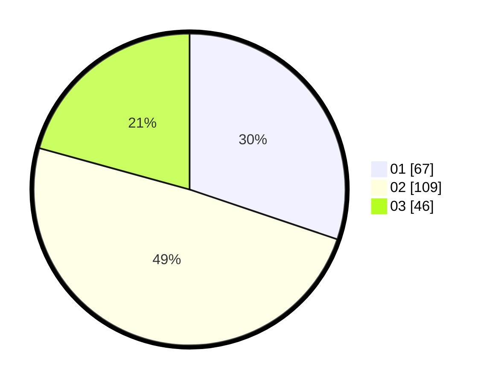

# Hasil

Hasil perolehan suara paslon dapat dilihat pada file paslon-01.txt, paslon-02.txt, dan paslon-03.txt.

Jika tidak ada, artinya data tersebut belum ada pada SIREKAP.

## Perolehan Suara

 * Paslon 01: **67**.
 * Paslon 02: **109**.
 * Paslon 03: **46**.

## Foto C Plano

https://sirekap-obj-formc.kpu.go.id/2bc8/pemilu/ppwp/31/71/03/10/01/3171031001016-20240214-214419--6c637312-a898-4f9f-b9fc-f70d37c79902.jpg

https://sirekap-obj-formc.kpu.go.id/2bc8/pemilu/ppwp/31/71/03/10/01/3171031001016-20240214-214525--74e4847b-e274-4612-8cd8-7250e14b9a73.jpg

https://sirekap-obj-formc.kpu.go.id/2bc8/pemilu/ppwp/31/71/03/10/01/3171031001016-20240214-214636--2a30bfd1-5820-4a5d-a7cb-cbb06106982c.jpg

## DATA PEMILIH TETAP

Jumlah pemilih dalam DPT: **292**.
 * L: **139**.
 * P: **153**.

## DATA PENGGUNA HAK PILIH

Jumlah pengguna hak pilih dalam DPT: **215**.
 * L: **99**.
 * P: **116**.

Jumlah pengguna hak pilih dalam DPTb: **5**.
 * L: **3**.
 * P: **2**.

Jumlah pengguna hak pilih dalam DPK: **6**.
 * L: **2**.
 * P: **4**.

Jumlah pengguna hak pilih: **226**.
 * L: **104**.
 * P: **123**.

## JUMLAH SUARA SAH DAN TIDAK SAH

JUMLAH SELURUH SUARA SAH: **222**.

JUMLAH SUARA TIDAK SAH: **5**.

JUMLAH SELURUH SUARA SAH DAN SUARA TIDAK SAH: **227**.
